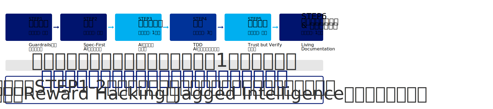

# AI活用研修 スライド資料（Marp版）

このディレクトリには、Marp形式に変換されたセミナースライドが含まれています。

## ファイル構成

- `day1_1.md` - 1日目 Part 1（10:00-12:00）：イントロダクション、Claude Code、要件定義、設計
- `day1_2.md` - 1日目 Part 2（13:00-14:50）：タスク分解、実装、品質担保、リファクタリング
- `day1_3.md` - 1日目 Part 3（15:00-17:00）：振り返り、演習
- `day2_1.md` - 2日目 Part 1（10:00-12:00）：リバースエンジニアリング、テストシナリオ
- `day2_2.md` - 2日目 Part 2（13:00-17:00）：実践演習、成果発表、まとめ
- `diagram_prompts.md` - 図表作成用プロンプト集（21個）

## Marpについて

Marp（Markdown Presentation Ecosystem）は、Markdownからスライドを生成するツールです。

### インストール

```bash
# Marp CLI をインストール
npm install -g @marp-team/marp-cli

# または VS Code拡張機能を使用
# 「Marp for VS Code」をインストール
```

### スライド生成方法

#### PDFに変換

```bash
marp day1_1.md -o day1_1.pdf
marp day1_2.md -o day1_2.pdf
marp day1_3.md -o day1_3.pdf
marp day2_1.md -o day2_1.pdf
marp day2_2.md -o day2_2.pdf

# 全ファイルを一括変換
marp day*.md --pdf
```

#### HTMLに変換

```bash
marp day1_1.md -o day1_1.html
marp day1_2.md -o day1_2.html

# 全ファイルを一括変換
marp day*.md --html
```

#### PowerPointに変換

```bash
marp day1_1.md -o day1_1.pptx
marp day1_2.md -o day1_2.pptx

# 全ファイルを一括変換
marp day*.md --pptx
```

#### プレビュー（VS Code）

1. VS Codeで `.md` ファイルを開く
2. 右上の「Marp Preview」アイコンをクリック
3. リアルタイムでスライドプレビューが表示される

#### プレビュー（CLI）

```bash
marp -s day1_1.md
# ブラウザで http://localhost:8080 を開く
```

## Marp構文のポイント

### スライド区切り

```markdown
---
```

### セクションスライド（タイトルのみ）

```markdown
---

<!-- _class: lead -->

# セクションタイトル
```

### 通常スライド

```markdown
---

# スライドタイトル

- 箇条書き1
- 箇条書き2
```

### Front Matter（ファイル先頭）

```yaml
---
marp: true
theme: default
paginate: true
header: 'ヘッダーテキスト'
footer: '© 2024 AI Development Seminar'
---
```

## カスタマイズ

### テーマの変更

```yaml
---
marp: true
theme: gaia  # default, gaia, uncover
---
```

### ページ番号の表示/非表示

```yaml
---
marp: true
paginate: true  # ページ番号を表示
---
```

### 背景色の変更（個別スライド）

```markdown
---

<!-- _backgroundColor: #123456 -->

# このスライドだけ背景色を変更
```

## 図表の挿入

図表を挿入する場合は、`diagram_prompts.md`のプロンプトを使ってSVGを生成し、以下のように挿入してください：

```markdown
---

# 5-STEPフロー全体像



- STEP1: 要件定義
- STEP2: 設計
...
```

## トラブルシューティング

### 日本語フォントが表示されない

CSSでフォントを指定：

```yaml
---
marp: true
style: |
  section {
    font-family: 'Noto Sans JP', sans-serif;
  }
---
```

### 箇条書きが多すぎて1スライドに収まらない

以下のいずれかで対応：
1. スライドを分割（`---`で区切る）
2. フォントサイズを小さくする
3. 2カラムレイアウトを使用

```markdown
<style scoped>
section { font-size: 22px; }
</style>
```

## 参考リンク

- [Marp公式サイト](https://marp.app/)
- [Marp CLI ドキュメント](https://github.com/marp-team/marp-cli)
- [Marp for VS Code](https://marketplace.visualstudio.com/items?itemName=marp-team.marp-vscode)
