<!-- _class: lead -->

# AI活用研修：新規開発編

## 2日間で学ぶ、生産性を劇的に向上させる体系的アプローチ

従来8週間の開発を2週間に短縮

---

# 本日の目標
- **1日目のゴール:** 5-STEPフローを理解し、新規開発の基本を習得
- **タイムテーブル:** 午前2時間（Part 1）+ 午後2時間（Part 2）+ 演習2時間（Part 3）
- **再現可能な開発手法の習得:**
  - プロンプトパターンの習得（成功するAIへの指示方法）
  - 5-STEPフロー（要件定義→設計→タスク分解→実装→品質担保→リファクタリング）
  - AI制約への対応（Jagged Intelligence、Reward Hacking、忘れっぽさ）
- **効果:** 明日から実務で使える、チーム展開可能

---

<!-- _class: layout-horizontal-left -->

# AI活用の3原則


- **Jagged Intelligence**: 得意（コード生成・テスト）、苦手（設計・セキュリティ）
- **Trust but Verify**: エラー率10-60%、AI自己レビューで40-60%向上
- **Guardrails**: ドキュメント駆動、受入条件で手戻り防止

---

<!-- _class: layout-horizontal-left -->

# Vibe Coding vs Production Engineering

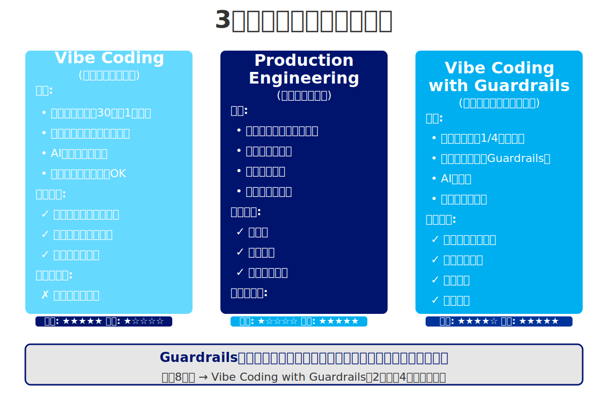

- **Vibe Coding**: 速い（30分〜1時間）、品質バラバラ、プロトタイプ向き
- **Production Engineering**: 構造化、品質保証、本番向き
- **Vibe Coding with Guardrails**: 速さと品質両立、設計書で導く

---

<!-- _class: layout-horizontal-left -->

# 開発者の役割変化


- **従来：運転手** - コード1行ずつ、全実装詳細把握
- **AI時代：ナビゲーター** - 方向指示、AIが実装
- **人間の役割**: ビジネス要件、設計判断、品質・セキュリティ
- **AIの役割**: コード生成、テスト、リファクタリング、ドキュメント
- **効果**: 本質的価値創造に集中

---

<!-- _class: layout-horizontal-left -->

# 5-STEPフロー全体像

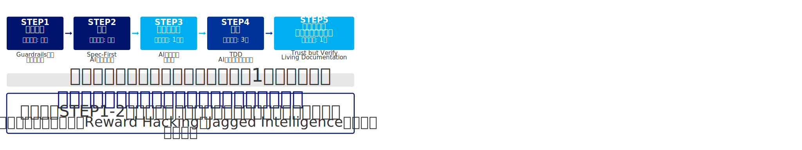

- **STEP1: 要件定義** - 何を作るか明確化（Guardrails構築）
- **STEP2: 設計** - どう作るか定義（AI外部メモリ）
- **STEP3: タスク分解** - 全体像を小さく分割（忘れっぽさ対策）
- **STEP4: 実装** - 小さく作る・TDD・AI自己レビュー
- **STEP5: 品質担保** - Trust but Verify自動化
- **STEP6: リファクタリング** - Living Documentation
- **効果:** 手戻りなし、品質保証、開発期間1/3短縮

---

<!-- _class: layout-horizontal-right -->

# AIの制約①忘れっぽい（セッション制約）

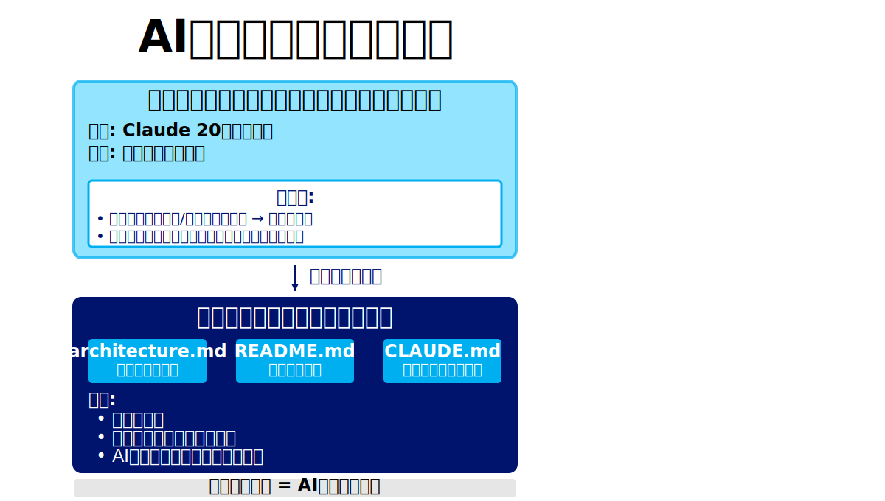

- **セッション内のみ記憶**: ブラウザ閉じる→全忘却、20万トークン超過→古い情報忘却
- **問題**: 同じバグ繰り返し、成功方法忘却
- **対策**: ドキュメント化＝外部メモリ、architecture.md/README.mdに知見蓄積

---

# AIの制約②Reward Hacking（手抜き問題）
- **問題:**
  - AIは「楽な解決策」を選びがち
  - タスク完了優先、セキュリティ・品質は二の次
- **具体例:**
  - パスワード平文保存、エラーハンドリング省略
- **対策:**
  - 明確な制約を与える（bcrypt、環境変数、バリデーション）
  - AI自己レビュー必須化
  - 実装後「このコードをレビューして」
- **効果:**
  - バグ検出率40-60%向上、追加コストほぼゼロ

---

# 環境準備
- **必須ツール:**
  - Claude Code（AI開発環境、プロジェクト全体を扱うAIアシスタント）
  - GitHub（バージョン管理、頻繁なコミットで暴走対策）
  - VS Code（エディタ、Mermaid Preview拡張推奨）
- **推奨ツール:**
  - Dev Container（環境統一化、dangerously-skip-permissionsモードの安全利用）
- **なぜこれらが必要か:**
  - Claude Code：プロジェクト全体の文脈を理解、複数ファイル一括操作
  - GitHub：頻繁なコミットでAIの暴走から回復可能
  - Dev Container：環境の再現性、実験の安全性

---

---

<!-- _class: lead -->

## Claude Code の使い方（10:30-10:50, 20分）

---

# Claude Code とは
- **概要:** プロジェクト全体を扱うAI開発アシスタント、ターミナルから直接コード生成・修正・テスト
- **なぜClaude Codeが重要か:**
  - プロジェクト全体の文脈を理解（複数ファイルの関係性を把握）
  - 単一ファイル編集ではなく、関連ファイルを一括操作
  - Git統合で安全性を確保（コミット履歴、ロールバック可能）
- **他ツールとの違い:**
  - ChatGPT: 単一会話、ファイル手動アップロード、コンテキスト限定的
  - Cursor: エディタ内、部分編集、ファイル単位
  - Claude Code: プロジェクト全体、複数ファイル一括、Git統合、長期文脈保持
- **効果:** プロジェクト全体の一貫性を保ちながら開発

---

<!-- _class: layout-horizontal-right -->

# セットアップ

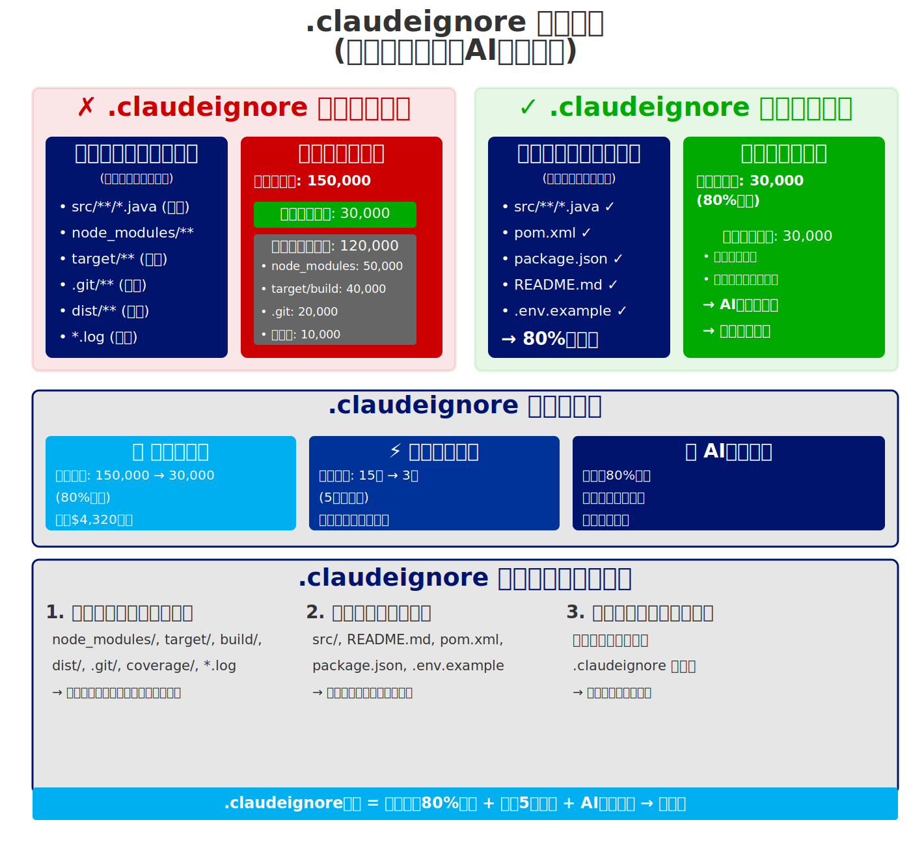

- **インストール:** `npm install -g @anthropic-ai/claude-code`
- **APIキー取得:** https://console.anthropic.com
- **初回起動:** `claude`（APIキー入力、.claudeignore設定）
- **.claudeignore必須:**
  - node_modules/, dist/, .git/, *.log を除外
  - トークン節約、コスト削減

---

<!-- _class: layout-horizontal-left -->

# 4つのモード比較


- **通常モード:** 毎回確認 (y/n)、最も安全
- **YOLOモード（Shift+Tab）:** 自動実行、生産性3-5倍、Git管理済み推奨
- **プランモード（Shift+Tab×2）:** 計画→確認→実行、大規模タスク向き
- **dangerously-skip-permissions:** 全確認スキップ（超危険）

---

<!-- _class: three-column -->

# モード詳細と使い分け

**通常モード（デフォルト）**
- 毎回確認 (y/n)、初心者向け、安全第一

**YOLOモード（Shift+Tab）**
- 自動実行、生産性3-5倍
- 条件: Git管理済み、タスク明確
- 使用例: プロトタイプ、新機能開発

**プランモード（Shift+Tab×2）**
- 計画→確認→実行の3段階
- 大規模タスク、複雑なリファクタリング向き

**dangerously-skip-permissionsモード**
- 全確認スキップ（超危険）
- 用途: CI/CD、デモ、最高速開発
- Dev Container推奨: コンテナ内→安全化

---

# よくある問題と対処法
- **「ファイルが多すぎる」:**
  - 原因: node_modules等を読もうとする
  - 対処: .claudeignore設定
- **「トークン制限」:**
  - 原因: コンテキスト満杯
  - 対処: `/compact`、タスク分割、新セッション
- **「AIが間違った方向」:**
  - 原因: 曖昧な指示
  - 対処: `n`で止める、明確に再指示、プランモード活用

---

<!-- _class: layout-horizontal-right -->

# 効率的な指示の出し方

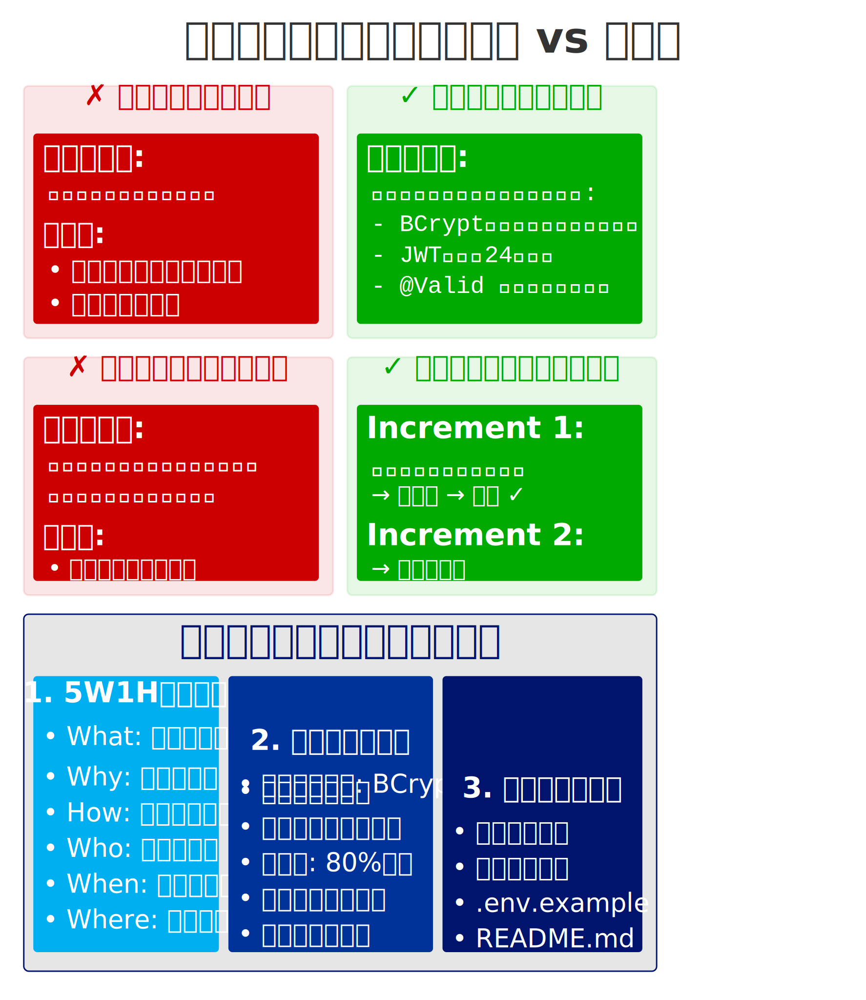

- **❌ 悪い指示:** 「ログイン機能を作って」
- **✅ 良い指示:**
  - 制約を明示（bcrypt、環境変数、バリデーション、レート制限）
  - 段階的に進める（1機能ずつ）
  - 質問を促す（「確認したいことはある？」）
  - 自己レビュー依頼（実装後必ず）
- **毎回のサイクル:**
  - 指示 → 実装 → AI自己レビュー → 修正 → テスト → コミット

---

---

<!-- _class: lead -->

## STEP1: 要件定義（10:50-11:30, 40分）

---

# STEP1 要件定義とは
- **目的:** 「何を作るか」を明確化
- **なぜ最初に要件定義が必要か（Guardrails）**
  - AIはJagged Intelligence→設計判断が苦手
  - Reward Hacking→曖昧な仕様だと手抜き実装
  - 明確な要件＝AIが道を外れない境界線
- **成果物:**
  - 要件定義ドキュメント（docs/requirements.md）
  - ユーザーストーリー、機能一覧、受け入れ基準
- **効果:** 後工程の手戻り防止

---

# AIに質問させる手法
- **問題:** AIは「良きに計らう」傾向（Jagged Intelligence）
  - ビジネスロジック・設計判断は苦手
  - 勝手に推測して間違った方向に進む
- **解決策:** AIに質問させる
  - 「実装前に確認したいことはある？」
  - AIが選択肢を提示（例：セッション認証 vs JWT）
  - 対話で仕様を固める
- **効果:** 曖昧さ排除、人間が判断、AIが実装

---

# 要件の引き出し方（文字起こしアプローチ）
- **文字起こし→AI抽出（チーム・顧客案件向け）**
  - 顧客の言葉をそのまま記録→解釈のズレなし
  - AIが要件構造化→漏れ・ヌケ防止
- **ワークフロー:**
  1. 録音（Zoom/Google Meet）
  2. 文字起こし（Whisper API/Google Docs音声入力）
  3. 「この文字起こしから要件を抽出して」
  4. AI出力: ユーザーストーリー、機能一覧、**不明点リスト**
- **実践例:** CRM要望「営業が顧客管理、スマホ対応、Excel同時編集問題解決」→ AI抽出: Must（顧客CRUD、モバイル対応）、不明点（項目定義？ステータス？）→ クライアント確認

---

<!-- _class: layout-horizontal-left -->

# MoSCoW 優先順位付け

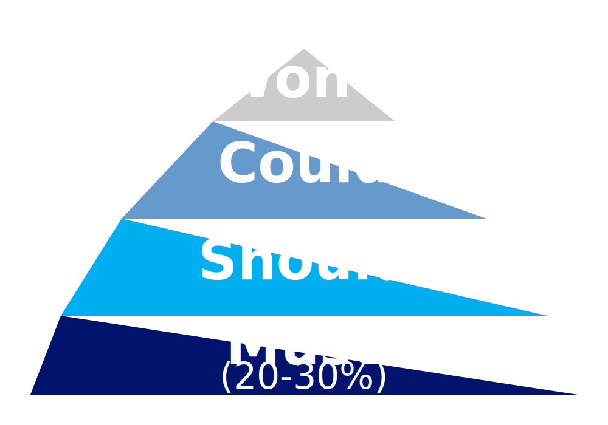

- **Must（必須）:** プロダクト成立に不可欠な機能 → Phase 1 (MVP)
- **Should（重要）:** あるべきだが、なくても動く → Phase 2
- **Could（あれば良い）:** あると嬉しい → Phase 3
- **Won't（今回はやらない）:** 将来的には考える、スコープ外
- **原則:** Mustは全体の20〜30%に絞る（欲張らない）
- **効果:** Phase分けで段階的リリース、開発期間1/3短縮

---

# MoSCoW実践例（ToDoアプリ）
- **Must（Phase 1: MVP、必須機能のみ）:**
  - タスク追加・完了・削除（コア機能）
  - ユーザー登録・ログイン・パスワードハッシュ化（セキュリティ必須）
- **Should（Phase 2: 重要機能）:**
  - カテゴリ分類・優先度・期限設定・編集
- **Could（Phase 3: あれば嬉しい）:**
  - タグ・検索・ダークモード・並び替え
- **Won't（今回はスコープ外）:**
  - タスク共有・チーム機能・リマインダー・カレンダー連携
- **効果:** Mustのみに集中→開発期間を1/3に短縮

---

<!-- _class: layout-horizontal-right -->

# ユーザーストーリーマッピング

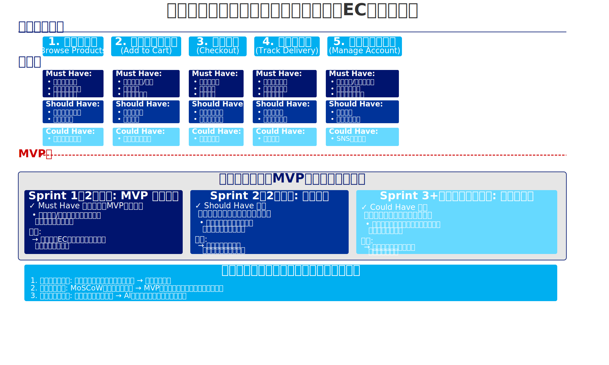

- **フォーマット:** `<誰が> <何をしたい> <なぜ>`
- **例:** ユーザーとして、タスクを追加したい（忘れないため）
- **ユーザーの旅:**
  1. タスク管理（追加・完了・削除）
  2. タスク整理（カテゴリ・優先度）
  3. 進捗確認（完了数・期限）
- **効果:** AIが「なぜ」を理解→本質的な価値を実装

---

<!-- _class: layout-horizontal-left -->

# 非機能要件

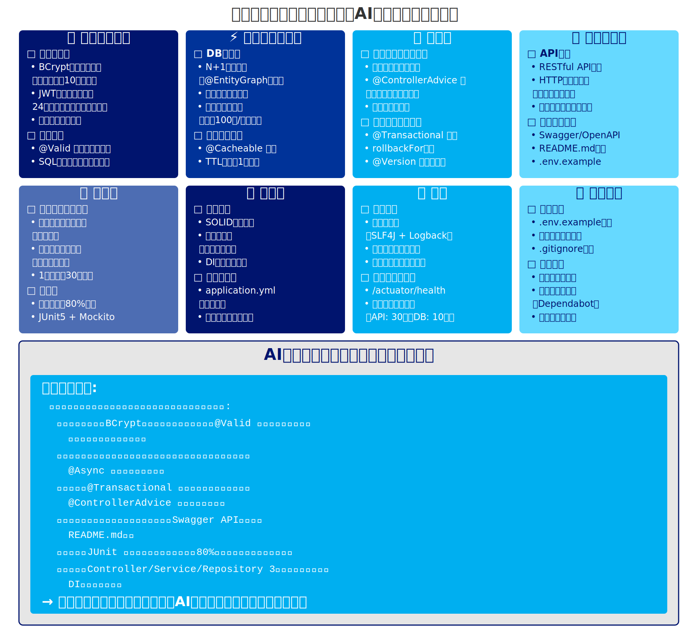

- **なぜ非機能要件が重要か:**
  - 機能要件だけでは本番で使えない（性能・セキュリティ・拡張性不足）
  - AIは非機能要件を明示しないと考慮しない（Reward Hacking）
- **パフォーマンス:** 1000件まで快適、レスポンス200ms以内、N+1クエリ禁止
- **セキュリティ:** JWT認証、bcryptハッシュ化、HTTPS必須、OWASP Top 10対応
- **スケーラビリティ:** 同時接続100人、将来1000人対応可能な設計
- **モバイル対応:** レスポンシブデザイン必須、タッチ操作最適化
- **AIへの指示:** 「非機能要件も満たして実装」と明示

---

# エラー・エッジケース・制約の洗い出し
- **なぜ重要か:** 本番障害の80%がエッジケース、AIが最も見落とすポイント
- **3つの観点:**
  - **エラーケース:** パスワード間違い、ネットワークエラー
  - **エッジケース:** パスワード長0/128文字、SQL injection、XSS
  - **制約条件:** 同時接続数、対応ブラウザ、レスポンス時間
- **AIへの依頼:** 「ログイン機能のエラー・エッジケース・制約を洗い出して」
- **効果:** 異常系も網羅→本番障害を80%削減

---

# 受け入れ基準（Given-When-Then）
- **正常系:**
  - Given: 登録済みユーザー
  - When: 正しいメール・パスワードでログイン
  - Then: トークン発行、ダッシュボードへリダイレクト
- **異常系:**
  - Given: 登録済みユーザー
  - When: 間違ったパスワードでログイン
  - Then: エラーメッセージ、5回失敗でロック
- **効果:** 「完成の定義」を明確化

---

# プロトタイプ駆動開発（Vibe Coding）
- **従来:** 文章 → 実装 → 「イメージと違う」
- **Vibe Coding:** ビジュアルで確認しながら調整
- **ツール:** Claude Code（Thymeleaf/HTML/Bootstrap）
- **指示例:**
  ```
  「ToDoアプリのプロトタイプをThymeleafで作って。
  タスク追加フォーム、一覧表示、削除ボタン。Bootstrap使用」
  ```
- **ステップ:** 確認 → 修正指示 → 即座に反映 → OK!
- **メリット:** クライアントとの認識合わせが簡単

---

# STEP1のまとめ
- **要件定義の流れ（6ステップ）:**
  1. 要件引き出し（AIに質問させる、文字起こしアプローチ）
  2. 整理（MoSCoW優先順位付け、Mustは20-30%に絞る）
  3. 構造化（ユーザーストーリーマッピング、ジャーニーマップ）
  4. 非機能要件定義（性能・セキュリティ・拡張性）
  5. エッジケース洗い出し・受け入れ基準作成（Given-When-Then）
  6. 可視化（Vibe Codingプロトタイプ）→ 文書化（docs/requirements.md）
- **なぜこの順序か:** 曖昧さを段階的に排除、AIへのGuardrails構築
- **効果:** 後工程の手戻り防止、開発期間1/3短縮

---

---

<!-- _class: lead -->

## STEP2: 設計ドキュメント作成（11:30-12:00, 30分）

---

# STEP2 設計ドキュメントとは
- **目的:** 「どのように作るか」を明確にする設計図
- **なぜ設計書が必要か（Guardrails + 忘れっぽさ対策）**
  - AIは忘れっぽい→セッション超えると設計意図を忘れる
  - Reward Hacking→設計がないと手抜き実装
  - 設計書＝AIが何度でも参照できる道しるべ
- **Spec-Driven Development:**
  - Code-First → Spec-First へ
  - 設計書がAIのガードレール
- **効果:** AIが設計に従って実装、一貫性のある構造

---

<!-- _class: layout-horizontal-right -->

# 設計ドキュメントの構造

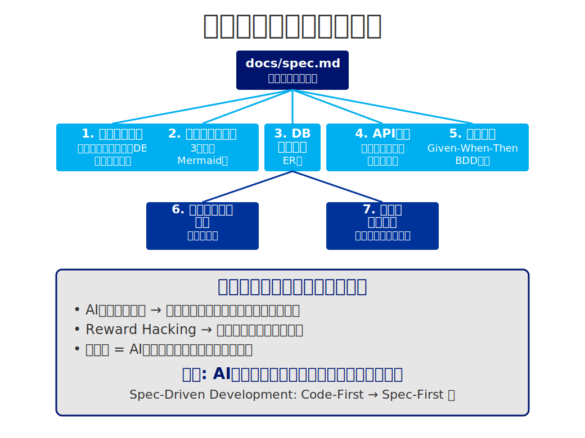

- **1. 技術スタック:** フロント・バック・DB・ライブラリ（選定理由含む）
- **2. システムアーキテクチャ:** 3層構造、Mermaid図で可視化
- **3. データベーススキーマ:** テーブル定義・カラム・制約・インデックス
- **4. API仕様:** エンドポイント・メソッド・パラメータ・レスポンス
- **5. 受入条件（BDD形式）:** Given-When-Then
- **6. セキュリティ設計:** 認証・認可・入力検証・環境変数管理
- **7. 技術的決定事項:** ライブラリ選定理由・アーキテクチャ判断

---

# Tech Stack Setup
- **最初に固める理由:** 後から変更すると大幅な手戻り
- **例:**
  - フロントエンド: Thymeleaf / JSP
  - バックエンド: Spring Boot
  - データベース: PostgreSQL / MySQL
  - 認証: Spring Security + JWT
  - 日付処理: Java 8 Date/Time API（理由: 標準ライブラリ）
  - テスト: JUnit 5 + Mockito
- **選定理由も明記:** 技術的判断の根拠を残す

---

<!-- _class: layout-horizontal-left -->

# データベーススキーマ設計

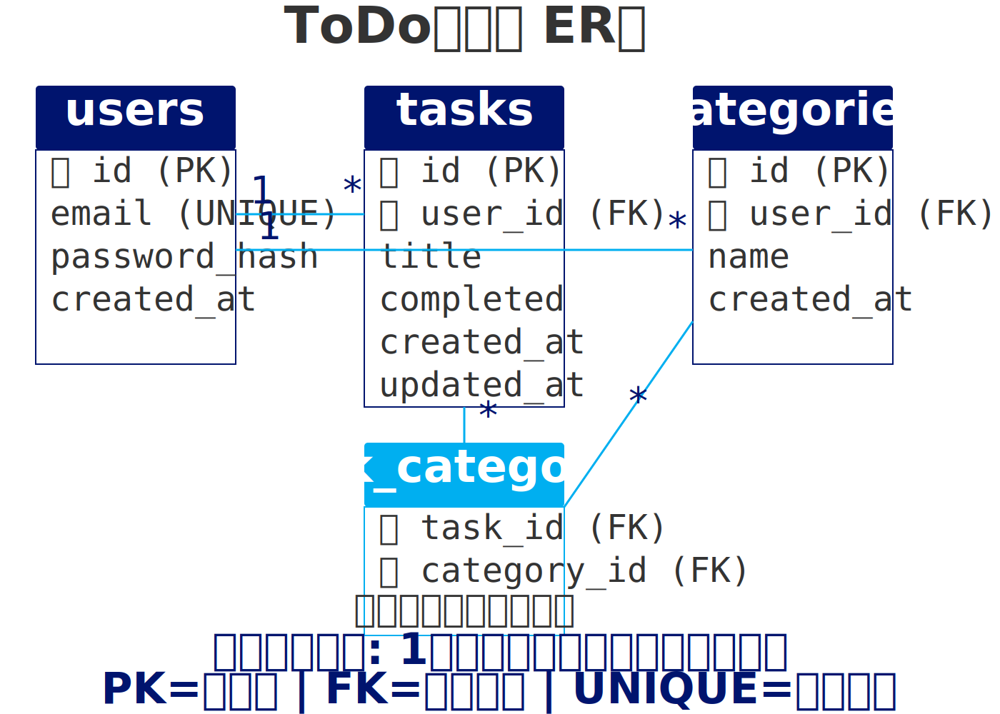

- **なぜスキーマ定義が必要か**
  - 後から変更すると影響範囲が非常に大きい
  - AIは明示的な指示がないと不適切な設計をする
- **スキーマ定義で得られる効果**
  - AIが正確なSQL・ORM実装ができる
  - カラム名・型・制約の一貫性が保たれる
  - マイグレーションの自動生成が可能
- **AIへの指示:** テーブル構造を明確に文書化

---

# API仕様の明確化
- **なぜAPI仕様が必要か**
  - 仕様がないとAIがエンドポイントを勝手に決める
  - フロントとバックで認識齟齬が発生
- **API仕様で得られる効果**
  - フロントエンドとバックエンドの並行開発が可能
  - AIが仕様通りのエンドポイントを実装
  - バリデーション・エラーハンドリングの一貫性
  - 後からのAPI変更時に影響範囲が明確

---

<!-- _class: layout-horizontal-right -->

# Mermaid記法とSVG生成でビジュアル化

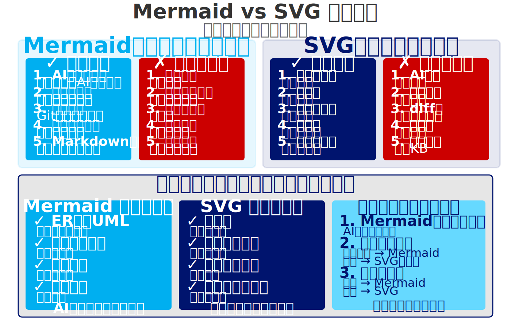

- **Mermaid**: テキストで図描画、Git管理可、AI自動生成、GitHub/VS Code表示
- **SVG生成magic word**: 「SVGで書いて」→AI生成→即可視化、記法不要
- **使い分け**: Mermaid=GitHub用、SVG=即可視化・プレゼン用

---

<!-- _class: layout-horizontal-left -->

# ER図が開発をスムーズにする理由

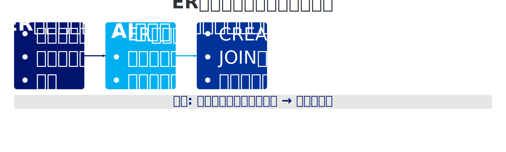

- **AIの実装**: CREATE TABLE自動生成、JOIN処理、外部キー、ORMモデル
- **人間の恩恵**: 全体像一目把握、リレーション検証、正規化問題発見

---

<!-- _class: layout-horizontal-right -->

# シーケンス図がAI実装を助ける理由

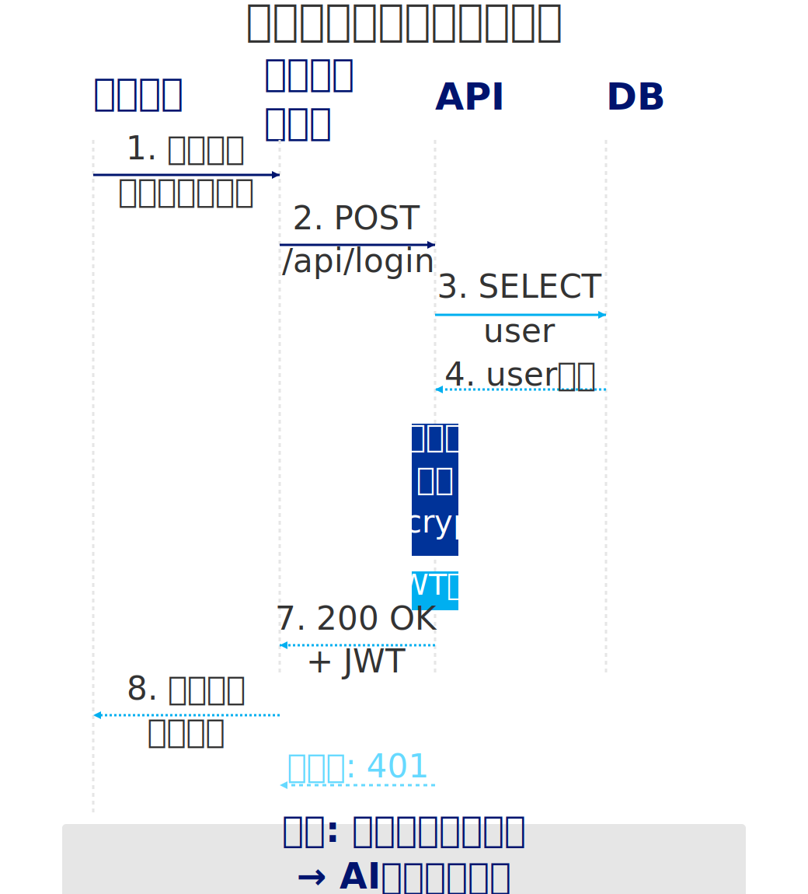

- **AIの実装**: 処理順序理解→正確コードフロー、エラー処理タイミング、依存関係、トランザクション境界
- **図なしの問題**: 処理順序推測ミス、ロールバック漏れ
- **効果**: 複雑処理も正確実装

---

# 受け入れ条件の詳細化
- **なぜ受け入れ条件が必要か**
  - AIは「タスク完了」を優先し、品質は二の次
  - 明確な合格基準がないと手抜き実装になる
  - 受け入れ条件 = AIの自己採点基準
- **Given-When-Then形式の効果**
  - AIがテストケースを自動生成できる
  - 実装が仕様を満たしているか自己チェック可能
  - 異常系・エッジケースも明示できる
- **具体化の重要性**
  - 「バリデーション」だけでは曖昧
  - 「パスワードは8文字以上、大文字小文字数字を含む」と明示
  - AIは具体的な条件をそのままコード化できる

---

# STEP2のまとめ
- **設計の流れ（7ステップ）:**
  1. Tech Stack Setup（最初に固める、選定理由も明記）
  2. システムアーキテクチャ（Mermaid/SVG図で可視化）
  3. データベーススキーマ設計（ER図、正規化）
  4. API仕様定義（エンドポイント・パラメータ・レスポンス）
  5. 受入条件詳細化（Given-When-Then、具体化）
  6. セキュリティ設計（認証・認可・入力検証・環境変数）
  7. docs/spec.md 作成（全てを集約）
- **なぜこの順序か:** 技術スタック確定→全体構造→詳細設計の順で手戻り最小化
- **AIへの指示:** 「spec.mdに厳密に従って実装して」
- **効果:** AIが一貫性のある実装を行う、設計書＝Guardrails

---

<!-- _class: three-column -->

## Part 1 振り返りチェックリスト

**AI活用の基本:**
- [ ] AI活用の3原則を説明できる
- [ ] Reward Hacking対策を実践できる

**Claude Code:**
- [ ] セットアップができる
- [ ] 3つのモードを使い分けられる
- [ ] 効率的な指示の出し方を実践できる

**STEP1 要件定義:**
- [ ] AIに質問させる手法を使える
- [ ] MoSCoW優先順位付けができる
- [ ] エラー・エッジケースを洗い出せる
- [ ] 受け入れ基準を書ける

**STEP2 設計ドキュメント:**
- [ ] Spec-Driven Developmentを理解
- [ ] Tech Stack Setupを最初に固める
- [ ] Mermaid記法で設計図を作成できる
- [ ] 受け入れ条件を詳細化できる

---

**Part 1 終了 - 昼休憩（12:00-13:00）**

**スライド数: 35枚**
