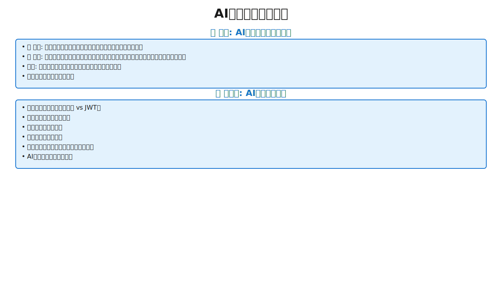

<!-- _class: lead -->

# AI活用研修：新規開発編

## 2日間で学ぶ、生産性を劇的に向上させる体系的アプローチ

AI駆動開発で開発期間を大幅短縮

---
<!-- _class: layout-diagram-only -->

# 本日の目標


---

<!-- _class: layout-horizontal-left -->

# AI活用の3原則


- **Jagged Intelligence**: 得意（コード生成・テスト・アーキテクチャ設計）、苦手（ビジネス要件の解釈・トレードオフ判断）
- **Trust but Verify**: AIにもエラーあり、AI自己レビューで品質向上
- **Guardrails**: ドキュメント駆動、受入条件で手戻り防止

---

<!-- _class: layout-horizontal-left -->

# Vibe Coding vs Production Engineering


- **Vibe Coding**: 速い（30分〜1時間）、品質バラバラ、プロトタイプ向き
- **Production Engineering**: 構造化、品質保証、本番向き
- **Vibe Coding with Guardrails**: 速さと品質両立、設計書で導く

---

<!-- _class: layout-horizontal-left -->

# 開発者の役割変化


- **従来：運転手** - コード1行ずつ、全実装詳細把握
- **AI時代：ナビゲーター** - 方向指示、AIが実装
- **人間の役割**: ビジネス要件、設計判断、品質・セキュリティ
- **AIの役割**: コード生成、テスト、リファクタリング、ドキュメント
- **効果**: 本質的価値創造に集中

---

<!-- _class: layout-horizontal-left -->

# 5-STEPフロー全体像


- **STEP1: 要件定義** - 何を作るか明確化（Guardrails構築）
- **STEP2: 設計** - どう作るか定義（AI外部メモリ）
- **STEP3: タスク分解** - 全体像を小さく分割（忘れっぽさ対策）
- **STEP4: 実装** - 小さく作る・TDD・AI自己レビュー
- **STEP5: 品質担保＆ドキュメント反映** - Trust but Verify自動化、Living Documentation
- **効果:** 手戻り防止、品質保証、開発期間短縮

---

<!-- _class: layout-horizontal-right -->

# AIの制約①忘れっぽい（セッション制約）


- **セッション内のみ記憶**: ブラウザ閉じる→全忘却、20万トークン超過→古い情報忘却
- **問題**: 同じバグ繰り返し、成功方法忘却
- **対策**: ドキュメント化＝外部メモリ、architecture.md/README.mdに知見蓄積

---

<!-- _class: layout-diagram-only -->

# AIの制約②Reward Hacking（手抜き問題）


---
<!-- _class: layout-diagram-only -->

# 環境準備


---

<!-- _class: layout-horizontal-left compact -->

# セキュリティベストプラクティス（補足）


**AIに必ず指示すべきセキュリティ要件:**

**🔒 認証・認可:** bcrypt、JWT、環境変数

**🛡️ 入力検証:** SQLi/XSS対策、CSRF

**🔐 データ保護:** HTTPS、機密情報は環境変数

**📊 監視:** レート制限、異常検知

---

---

<!-- _class: lead -->

## Claude Code の使い方（10:30-10:50, 20分）

---

# Claude Code とは
- **概要:** プロジェクト全体を扱うAI開発アシスタント、ターミナルから直接コード生成・修正・テスト
- **なぜClaude Codeが重要か:**
  - プロジェクト全体の文脈を理解（複数ファイルの関係性を把握）
  - 単一ファイル編集ではなく、関連ファイルを一括操作
  - Git統合で安全性を確保（コミット履歴、ロールバック可能）
- **他ツールとの違い:**
  - ChatGPT: 単一会話、ファイル手動アップロード、コンテキスト限定的
  - Cursor: エディタ内、部分編集、ファイル単位
  - Claude Code: プロジェクト全体、複数ファイル一括、Git統合、長期文脈保持
- **効果:** プロジェクト全体の一貫性を保ちながら開発

---

<!-- _class: layout-horizontal-right -->

# セットアップ


- **インストール:** `npm install -g @anthropic-ai/claude-code`
- **APIキー取得:** https://console.anthropic.com
- **初回起動:** `claude`（APIキー入力、.claudeignore設定）
- **.claudeignore必須:**
  - node_modules/, dist/, .git/, *.log を除外
  - トークン節約、コスト削減

---

<!-- _class: layout-horizontal-left -->

# 4つのモード比較


- **通常モード:** 毎回確認 (y/n)、最も安全
- **YOLOモード（Shift+Tab）:** 自動実行、確認時間を大幅削減、Git管理済み推奨
- **プランモード（Shift+Tab×2）:** 計画→確認→実行、大規模タスク向き
- **dangerously-skip-permissions:** 全確認スキップ（超危険）

---

<!-- _class: two-column -->

# モード詳細と使い分け

**通常モード（デフォルト）**
- 毎回確認 (y/n)、初心者向け、安全第一

**YOLOモード（Shift+Tab）**
- 自動実行、確認作業を省略して効率化
- 条件: Git管理済み、タスク明確
- 使用例: プロトタイプ、新機能開発

**プランモード（Shift+Tab×2）**
- 計画→確認→実行の3段階
- 大規模タスク、複雑なリファクタリング向き

**dangerously-skip-permissionsモード**
- 全確認スキップ（超危険）
- 用途: CI/CD、デモ、最高速開発
- Dev Container推奨: コンテナ内→安全化

---
<!-- _class: layout-diagram-only -->

# よくある問題と対処法


---

<!-- _class: layout-horizontal-right compact -->

# 効率的な指示の出し方


**❌ 悪い:** 「ログイン機能を作って」

**✅ 良い:** 制約明示（bcrypt、環境変数、@Valid）、段階的実装、質問促す、AI自己レビュー

**サイクル:** 指示→実装→レビュー→テスト→コミット

---

---

<!-- _class: lead -->

## STEP1: 要件定義（10:50-11:30, 40分）

---

# STEP1 要件定義とは
- **目的:** 「何を作るか」を明確化
- **なぜ最初に要件定義が必要か（Guardrails）**
  - AIはJagged Intelligence（技術実装は得意だがビジネス要件の解釈は苦手）
  - Reward Hacking→曖昧な仕様だと手抜き実装
  - 明確な要件＝AIが道を外れない境界線
- **成果物:**
  - 要件定義ドキュメント（docs/requirements.md）
  - ユーザーストーリー、機能一覧、受け入れ基準
- **効果:** 後工程の手戻り防止

---
<!-- _class: layout-diagram-only -->

# AIに質問させる手法



---

<!-- _class: layout-horizontal-left -->

# 要件の引き出し方（文字起こしアプローチ）


## なぜ強力か

**顧客の言葉をそのまま記録:** 解釈のズレゼロ、「言った/言わない」問題の解消

**AIが要件構造化:** 漏れ・ヌケ防止、自動優先順位付け

## 4ステップ

**STEP1: 録音** Zoom/Google Meet録画

**STEP2: 文字起こし** Whisper API、Claude Code直接音声入力

**STEP3: AI抽出** 「この文字起こしから要件を抽出して」

**STEP4: 確認** ユーザーストーリー、MoSCoW分類、不明点確認

---

<!-- _class: layout-horizontal-left -->

# MoSCoW 優先順位付け


- **Must（必須）:** プロダクト成立に不可欠な機能 → Phase 1 (MVP)
- **Should（重要）:** あるべきだが、なくても動く → Phase 2
- **Could（あれば良い）:** あると嬉しい → Phase 3
- **Won't（今回はやらない）:** 将来的には考える、スコープ外
- **原則:** Mustは全体の20〜30%に絞る（欲張らない）
- **効果:** Phase分けで段階的リリース、開発期間短縮

---

<!-- _class: layout-diagram-only -->

# MoSCoW実践例（ToDoアプリ）


---

<!-- _class: layout-horizontal-right -->

# ユーザーストーリーマッピング


- **フォーマット:** `<誰が> <何をしたい> <なぜ>`
- **例:** ユーザーとして、タスクを追加したい（忘れないため）
- **ユーザーの旅:**
  1. タスク管理（追加・完了・削除）
  2. タスク整理（カテゴリ・優先度）
  3. 進捗確認（完了数・期限）
- **効果:** AIが「なぜ」を理解→本質的な価値を実装

---

<!-- _class: layout-horizontal-left compact -->

# 非機能要件


**なぜ重要か:** 機能要件だけでは本番で使えない（性能・セキュリティ・拡張性）

**⚡ パフォーマンス:** 1000件快適、200ms以内

**🔒 セキュリティ:** JWT、bcrypt、HTTPS

**📈 スケーラビリティ:** 同時100人

**📱 モバイル:** レスポンシブ

---

<!-- _class: layout-diagram-only -->

# エラー・エッジケース・制約の洗い出し


---

# 受け入れ基準（Given-When-Then）
- **正常系:**
  - Given: 登録済みユーザー
  - When: 正しいメール・パスワードでログイン
  - Then: トークン発行、ダッシュボードへリダイレクト
- **異常系:**
  - Given: 登録済みユーザー
  - When: 間違ったパスワードでログイン
  - Then: エラーメッセージ、5回失敗でロック
- **効果:** 「完成の定義」を明確化

---

# プロトタイプ駆動開発（Vibe Coding）
- **従来:** 文章 → 実装 → 「イメージと違う」
- **Vibe Coding:** ビジュアルで確認しながら調整
- **ツール:** Claude Code（Thymeleaf/HTML/Bootstrap）
- **指示例:**
  ```
  「ToDoアプリのプロトタイプをThymeleafで作って。
  タスク追加フォーム、一覧表示、削除ボタン。Bootstrap使用」
  ```
- **ステップ:** 確認 → 修正指示 → 即座に反映 → OK!
- **メリット:** クライアントとの認識合わせが簡単

---
<!-- _class: layout-diagram-only -->

# STEP1のまとめ


---

<!-- _class: layout-horizontal-left -->

# STEP1 チェックリスト


**必ず確認:**
- [ ] AIに質問させて曖昧さ排除
- [ ] MoSCoW優先順位付け
- [ ] ユーザーストーリー作成
- [ ] 非機能要件定義
- [ ] エラー・エッジケース洗い出し
- [ ] Given-When-Then基準作成
- [ ] docs/requirements.md文書化

---

---

<!-- _class: lead -->

## STEP2: 設計ドキュメント作成（11:30-12:00, 30分）

---

# STEP2 設計ドキュメントとは
- **目的:** 「どのように作るか」を明確にする設計図
- **なぜ設計書が必要か（Guardrails + 忘れっぽさ対策）**
  - AIは忘れっぽい→セッション超えると設計意図を忘れる
  - Reward Hacking→設計がないと手抜き実装
  - 設計書＝AIが何度でも参照できる道しるべ
- **Spec-Driven Development:**
  - Code-First → Spec-First へ
  - 設計書がAIのガードレール
- **効果:** AIが設計に従って実装、一貫性のある構造

---

<!-- _class: layout-horizontal-right -->

# 設計ドキュメントの構造


- **1. 技術スタック:** フロント・バック・DB・ライブラリ（選定理由含む）
- **2. システムアーキテクチャ:** 3層構造、Mermaid図で可視化
- **3. データベーススキーマ:** テーブル定義・カラム・制約・インデックス
- **4. API仕様:** エンドポイント・メソッド・パラメータ・レスポンス
- **5. 受入条件（BDD形式）:** Given-When-Then
- **6. セキュリティ設計:** 認証・認可・入力検証・環境変数管理
- **7. 技術的決定事項:** ライブラリ選定理由・アーキテクチャ判断

---

# Tech Stack Setup
- **最初に固める理由:** 後から変更すると大幅な手戻り
- **例:**
  - フロントエンド: Thymeleaf / JSP
  - バックエンド: Spring Boot
  - データベース: PostgreSQL / MySQL
  - 認証: Spring Security + JWT
  - 日付処理: Java 8 Date/Time API（理由: 標準ライブラリ）
  - テスト: JUnit 5 + Mockito
- **選定理由も明記:** 技術的判断の根拠を残す

---

<!-- _class: layout-horizontal-left -->

# データベーススキーマ設計


- **なぜスキーマ定義が必要か**
  - 後から変更すると影響範囲が非常に大きい
  - AIは明示的な指示がないと不適切な設計をする
- **スキーマ定義で得られる効果**
  - AIが正確なSQL・ORM実装ができる
  - カラム名・型・制約の一貫性が保たれる
  - マイグレーションの自動生成が可能
- **AIへの指示:** テーブル構造を明確に文書化

---

# API仕様の明確化
- **なぜAPI仕様が必要か**
  - 仕様がないとAIがエンドポイントを勝手に決める
  - フロントとバックで認識齟齬が発生
- **API仕様で得られる効果**
  - フロントエンドとバックエンドの並行開発が可能
  - AIが仕様通りのエンドポイントを実装
  - バリデーション・エラーハンドリングの一貫性
  - 後からのAPI変更時に影響範囲が明確

---

<!-- _class: layout-horizontal-right -->

# Mermaid記法とSVG生成でビジュアル化


- **Mermaid**: テキストで図描画、Git管理可、AI自動生成、GitHub/VS Code表示
- **SVG生成magic word**: 「SVGで書いて」→AI生成→即可視化、記法不要
- **使い分け**: Mermaid=GitHub用、SVG=即可視化・プレゼン用

---

<!-- _class: layout-horizontal-left -->

# ER図が開発をスムーズにする理由


- **AIの実装**: CREATE TABLE自動生成、JOIN処理、外部キー、ORMモデル
- **人間の恩恵**: 全体像一目把握、リレーション検証、正規化問題発見

---

<!-- _class: layout-horizontal-right -->

# シーケンス図がAI実装を助ける理由


- **AIの実装**: 処理順序理解→正確コードフロー、エラー処理タイミング、依存関係、トランザクション境界
- **図なしの問題**: 処理順序推測ミス、ロールバック漏れ
- **効果**: 複雑処理も正確実装

---

# 受け入れ条件の詳細化
- **なぜ受け入れ条件が必要か**
  - AIは「タスク完了」を優先し、品質は二の次
  - 明確な合格基準がないと手抜き実装になる
  - 受け入れ条件 = AIの自己採点基準
- **Given-When-Then形式の効果**
  - AIがテストケースを自動生成できる
  - 実装が仕様を満たしているか自己チェック可能
  - 異常系・エッジケースも明示できる
- **具体化の重要性**
  - 「バリデーション」だけでは曖昧
  - 「パスワードは8文字以上、大文字小文字数字を含む」と明示
  - AIは具体的な条件をそのままコード化できる

---

<!-- _class: layout-diagram-only -->

# STEP2のまとめ


---

<!-- _class: layout-horizontal-left -->

# STEP2 チェックリスト


**必ず確認:**
- [ ] Tech Stack確定
- [ ] アーキテクチャ図作成
- [ ] ER図作成
- [ ] API仕様定義
- [ ] シーケンス図作成
- [ ] 受入条件詳細化
- [ ] セキュリティ設計
- [ ] docs/spec.md作成

---

<!-- _class: two-column -->

## Part 1 振り返りチェックリスト

**AI活用の基本:**
- [ ] AI活用の3原則を説明できる
- [ ] Reward Hacking対策を実践できる

**Claude Code:**
- [ ] セットアップができる
- [ ] 3つのモードを使い分けられる
- [ ] 効率的な指示の出し方を実践できる

**STEP1 要件定義:**
- [ ] AIに質問させる手法を使える
- [ ] MoSCoW優先順位付けができる
- [ ] エラー・エッジケースを洗い出せる
- [ ] 受け入れ基準を書ける

**STEP2 設計ドキュメント:**
- [ ] Spec-Driven Developmentを理解
- [ ] Tech Stack Setupを最初に固める
- [ ] Mermaid記法で設計図を作成できる
- [ ] 受け入れ条件を詳細化できる

---

**Part 1 終了 - 昼休憩（12:00-13:00）**

**スライド数: 35枚**

---
marp: true
theme: default
paginate: true
style: |
  /* デフォルト：上下レイアウト（図が大きい） */
  section img {
    max-width: 95%;
    max-height: 60vh;
    display: block;
    margin: 10px auto;
    object-fit: contain;
  }

  /* 左右レイアウト：図を左に */
  section.layout-horizontal-left {
    display: grid;
    grid-template-columns: 55% 45%;
    gap: 20px;
    align-items: start;
  }
  section.layout-horizontal-left h1 {
    grid-column: 1 / -1;
  }
  section.layout-horizontal-left img {
    max-width: 100%;
    max-height: 75vh;
    margin: 0;
  }
  section.layout-horizontal-left > :not(h1):not(img) {
    font-size: 19px;
  }
  section.layout-horizontal-left li {
    margin-bottom: 5px;
  }

  /* 左右レイアウト：図を右に */
  section.layout-horizontal-right {
    display: grid;
    grid-template-columns: 45% 55%;
    gap: 20px;
    align-items: start;
  }
  section.layout-horizontal-right h1 {
    grid-column: 1 / -1;
  }
  section.layout-horizontal-right img {
    max-width: 100%;
    max-height: 75vh;
    margin: 0;
    grid-column: 2;
    grid-row: 2;
  }
  section.layout-horizontal-right > :not(h1):not(img) {
    font-size: 19px;
    grid-column: 1;
  }
  section.layout-horizontal-right li {
    margin-bottom: 5px;
  }

  /* 図のみレイアウト：図を最大化 */
  section.layout-diagram-only img {
    max-width: 98%;
    max-height: 85vh;
  }

  /* 2カラムレイアウト：テキストのみのスライド向け */
  section.two-column {
    columns: 2;
    column-gap: 40px;
  }
  section.two-column h1, section.two-column h2, section.two-column h3 {
    column-span: all;
  }
  section.two-column ul, section.two-column ol {
    break-inside: avoid-column;
  }

  /* 3カラムレイアウト：チェックリスト、比較表など */
  section.three-column {
    columns: 3;
    column-gap: 25px;
    font-size: 18px;
  }
  section.three-column h1 {
    font-size: 32px;
    column-span: all;
  }
  section.three-column h2, section.three-column h3 {
    column-span: all;
    font-size: 22px;
  }
  section.three-column ul, section.three-column ol {
    break-inside: avoid-column;
  }
  section.three-column li {
    margin-bottom: 3px;
  }

  /* Compactレイアウト：オーバーフロー回避用 */
  section.compact {
    font-size: 16px;
    line-height: 1.4;
  }
  section.compact h1 {
    font-size: 28px;
    margin-bottom: 15px;
  }
  section.compact h2 {
    font-size: 20px;
    margin-top: 10px;
    margin-bottom: 8px;
  }
  section.compact h3 {
    font-size: 18px;
    margin-top: 8px;
    margin-bottom: 6px;
  }
  section.compact li {
    margin-bottom: 2px;
  }
  section.compact ul, section.compact ol {
    margin-top: 5px;
    margin-bottom: 5px;
  }

  /* 画像2枚横並び：Before/After、比較用 */
  section.two-images-horizontal {
    display: grid;
    grid-template-columns: 1fr 1fr;
    gap: 20px;
    align-items: start;
  }
  section.two-images-horizontal h1 {
    grid-column: 1 / -1;
  }
  section.two-images-horizontal img {
    max-width: 100%;
    max-height: 70vh;
    margin: 0;
  }

  /* 画像上、テキスト下（コンパクト）：図の下に詳細説明を書く場合 */
  section.image-top-compact img {
    max-width: 95%;
    max-height: 40vh;
    display: block;
    margin: 10px auto;
    object-fit: contain;
  }

  /* カード型グリッド：選択肢、ツール比較、ユースケース並列表示 */
  section.card-grid {
    display: grid;
    grid-template-columns: repeat(2, 1fr);
    gap: 20px;
    align-items: start;
  }
  section.card-grid h1 {
    grid-column: 1 / -1;
  }
  section.card-grid > :not(h1) {
    background: #f8f9fa;
    border: 2px solid #dee2e6;
    padding: 20px;
    border-radius: 8px;
  }
  section.card-grid h3 {
    margin-top: 0;
    color: #0066cc;
  }

  section {
    font-size: 24px;
    padding: 40px 60px;
  }
  h1 {
    font-size: 44px;
    margin-bottom: 15px;
  }
  h2 {
    font-size: 36px;
  }
  ul, ol {
    margin: 8px 0;
  }
  li {
    margin: 6px 0;
    line-height: 1.4;
  }
---

# Day 1-2: タスク分解 + 実装 + 品質担保 + リファクタリング (13:00-14:50)

---

<!-- _class: lead -->

## STEP3: タスク分解（35分）

---
<!-- _class: layout-diagram-only -->

# STEP3 タスク分解とは


---
<!-- _class: layout-diagram-only -->

# タスク分解 = AIの思考を言語化（重要）


---

# 計画書作成による可視化（重要）
- **早い段階での軌道修正が可能**
  - 実装後に修正するより、計画段階で修正する方が効率的
  - コスト削減・時間短縮の効果
- **Guardrailsとしての計画書**
  - AIが道を外れたら、計画書で元に戻せる
  - 手戻りコストを大幅に削減

---

<!-- _class: layout-horizontal-left -->

# Phase分け戦略（Phase 1-4）


- **なぜPhase分けが必要か**
  - 全部一度に作ると依存関係が複雑化→AIが混乱（忘れっぽい）
  - 段階的に作れば各Phaseで動作確認→早期問題発見
- **Phase 1（基盤）:** DB接続・認証基盤・基本CRUD
- **Phase 2（コア機能）:** ビジネスロジック・主要API
- **Phase 3（拡張機能）:** 検索・フィルタ・通知
- **Phase 4（仕上げ）:** パフォーマンス最適化・E2Eテスト
- **効果:** リスク最小化、確実な進捗

---
<!-- _class: layout-diagram-only -->

# タスク粒度（30分〜2時間）


---

<!-- _class: layout-horizontal-right -->

# 依存関係の可視化


- **なぜ依存関係の可視化が必要か**
  - 順序を間違えると手戻りが発生（DB未作成でAPI実装できない）
  - AIは依存関係の判断が苦手（タスク実行は得意だが順序判断は苦手）
- **並行作業可能なタスク:** フロントとバックを同時進行
- **順序が必要なタスク:** DB設計→マイグレーション→API実装
- **AIへの指示:** 「依存関係を明示してタスク一覧を作成して」
- **効果:** 効率的なスケジューリング、手戻り防止

---

<!-- _class: layout-horizontal-left -->

# タスク一覧テンプレート


- **必須項目:** Phase・タスク名・所要時間・依存関係・完了条件
- **なぜテンプレート化が必要か**
  - 曖昧な計画→AIが勝手に解釈（構造化タスクは得意だが自由形式は苦手）
  - 明確なフォーマット→AIが一貫した出力
- **進捗管理:** 一覧表でステータス可視化（未着手・進行中・完了）
- **チーム共有:** Markdown形式でGit管理、誰でも参照可能
- **AIへの指示:** 「このテンプレートでタスク一覧を作成して」

---

# AI活用でタスク自動生成
- **プロンプト例:** 「この設計書に基づいて、タスク一覧を作成して。Phase分けして、各タスクは30分〜2時間で完了できるようにして」
- **AIが自動生成する項目:** Phase・タスク名・所要時間・依存関係・完了条件
- **人間の役割:** レビュー・調整・優先順位づけ
- **生産性向上:** 計画作成時間が数時間→数分に短縮
- **Trust but Verify:** AI生成後、必ず人間が確認・調整

---
<!-- _class: layout-diagram-only -->

# STEP3のまとめ


---

<!-- _class: layout-horizontal-left -->

# STEP3 チェックリスト


**必ず確認:**
- [ ] タスク一覧AI生成
- [ ] Phase分け
- [ ] タスク粒度30分〜2時間
- [ ] 依存関係明示
- [ ] 完了条件記載
- [ ] 並行作業特定
- [ ] docs/tasks.md文書化

---

---

<!-- _class: lead -->

## STEP4: 実装（40分）

---
<!-- _class: layout-diagram-only -->

# 実装の3原則（AIの制約に対応）


---
<!-- _class: layout-diagram-only -->

# 実装の標準ワークフロー


---

<!-- _class: layout-horizontal-right -->

# TDD/BDD統合ワークフロー


- **なぜTDD/BDDが必要か**
  - テストなし→AIが作る→人間が手動テスト→エラー→修正（無限ループ）
  - テストあり→AIが作る→自動テスト→エラー→AI自己修正（自己完結）
- **Red（失敗するテストを書く）:** テストが仕様を定義
- **Green（最小実装）:** テストを通す最小コード
- **Refactor（改善）:** テストが保証するから安心してリファクタリング
- **BDD形式（Given-When-Then）:** 人間が読める仕様書になる

---

<!-- _class: layout-horizontal-left -->

# AIにTDD/BDDで実装させる


- **プロンプト例:** 「POST /api/register を TDD で実装して。Given-When-Then形式のテストを書き、正常系・異常系をカバー」
- **AIが自動で行うこと:**
  1. Given-When-Thenテストを先に書く
  2. 実装コードを書く
  3. テストを実行→失敗→修正→成功を繰り返す
- **人間の役割:** プロンプトで方向性を指示、結果をレビュー
- **効果:** バグが少なく設計が良くなる、AIが自己完結

---

<!-- _class: layout-horizontal-right -->

# セキュリティベストプラクティス（重要）


- **なぜセキュリティが後回しになるか（Reward Hacking）**
  - AIは「タスク完了」を最優先→セキュリティは二の次
  - 平文保存、ハードコーディングで「とりあえず動く」を選ぶ
  - セキュリティ知識はあるが、明示しないと省略する
- **対策：明確な制約を設定（Guardrails）**
  - パスワード→BCrypt、APIキー→環境変数
  - JWT秘密鍵→環境変数、入力値→@Valid必須
  - .env作成、.gitignore追加、.env.example用意

---
<!-- _class: layout-diagram-only -->

# パスワード・JWT認証の実装


---

# セキュアなコードの指示方法（重要）
- **なぜ明確な指示が必要か**
  - AIは暗黙の前提を理解できない（明示的な指示には従えるが推測は苦手）
  - セキュリティ要件は明示しないと実装されない
- **プロンプト例:** 「ユーザー登録APIを実装。BCrypt、環境変数、@Valid、レート制限、Spring Security、HTTPS、エラーメッセージ一般化」
- 明確な制約＝AIが安全な実装を行う

---

<!-- _class: layout-horizontal-left -->

# インクリメンタル開発とは


- **なぜ小さく作るべきか（AIは忘れっぽい対策）**
  - 全部一度に作る→完成まで動かない→問題発見が遅れる
  - 小さく作る→動かす→確認→早期発見
- **効果:** 進捗が見える、モチベーション維持、リスク低減

---

# インクリメンタル実装の実例
- **Increment 1: 一覧表示**
  - タスク一覧取得API実装→テスト→動作確認→コミット
- **Increment 2: 新規作成**
  - タスク作成API実装→テスト→動作確認→コミット
- **Increment 3: 完了チェック**
  - タスク完了API実装→テスト→動作確認→コミット
- **各Incrementで:** 動作確認→テスト実行→AI自己レビュー→コミット
- **効果:** 常に動く状態を維持、問題を早期発見

---

<!-- _class: layout-horizontal-right -->

# AI自己レビュー必須化（重要）


- **なぜAI自己レビューが重要か（Trust but Verify）**
  - AIにもエラーあり→自己レビューで多くを検出
  - Reward Hacking→実装後に手抜きチェック
  - Reward Hackingで省略されるため、セキュリティ観点での検証必須
- 実装後必ず：「このコードをレビューして。セキュリティ・エラー処理・エッジケース・ベストプラクティスをチェック」
- 追加コストほぼゼロで品質大幅向上

---
<!-- _class: layout-diagram-only -->

# STEP4のまとめ


---

<!-- _class: layout-horizontal-left -->

# STEP4 チェックリスト


**必ず確認:**
- [ ] タスク30分〜2時間
- [ ] Given-When-Thenテスト先行
- [ ] 最小実装でテスト通過
- [ ] AI自己レビュー
- [ ] セキュリティ要件満たす
- [ ] エラーハンドリング
- [ ] コミット実施

---

---

<!-- _class: lead -->

## STEP5: 品質担保＆ドキュメント反映（40分）

---

# STEP5 品質担保＆ドキュメント反映とは
- **なぜ品質担保とドキュメント反映が必要か**
  - **品質担保（Trust but Verify）:** AIにもエラーあり→検証なしでは本番投入不可
  - **ドキュメント反映（Living Documentation）:** AIは忘れっぽい→外部メモリ化が必須
- **TDDとAI活用の相乗効果**
  - テストがあれば→AIが自分でバグに気づき→自分で修正→自己完結
  - テストなし→人間が手動確認→エラー報告→修正依頼（非効率）
- **Living Documentationの価値**
  - 実装と同期したドキュメント、AIが過去の知見を参照できる
- **効果:** 品質保証の自動化、知見の蓄積、次セッションでの再利用

---

# テスト駆動開発とAI活用の相乗効果（重要）
- **なぜTDDとAIが相性抜群か**
  - テストがあれば、AIが自分でバグに気づき自分で修正
  - Trust（AI実装）→ Verify（テスト実行）→ 修正を自動化
- **TDDなし:** 人間が実行→エラー確認→コピペ→AI伝達の無限ループ
- **TDDあり:** AIが自動でテスト実行→エラー検知→修正
- 生産性が飛躍的に向上

---

# E2Eテスト重視の戦略
- **なぜE2Eテストを重視すべきか**
  - 実装詳細のテスト→リファクタリングで壊れる
  - E2Eテスト→ユーザー体験を検証、リファクタリングに強い
- 本当の価値（ユーザー体験）を保証

---

# Playwright によるE2Eテスト
- **なぜPlaywrightか**
  - ユーザー視点のテスト自動化、実ブラウザで動作確認
  - AIが自動でテストコード生成可能
- **プロンプト例:** 「ログイン→ダッシュボード表示のPlaywrightテストを作成して」
- **AIが生成:** ブラウザ起動→ログインフォーム入力→送信→画面遷移確認
- **本番環境と同じ条件:** 実際のユーザー体験を検証
- **効果:** UIバグ・統合問題を自動検出

---

# ビジュアルリグレッションテスト
- **なぜビジュアルテストが必要か**
  - コードは正しくても見た目が崩れる場合がある
  - 人間の目視確認は漏れが発生しやすい
- スクリーンショット比較で自動検出、差分があれば警告

---

# MCP関連ツール
- **なぜMCPが必要か**
  - AIのカットオフ問題→古いライブラリ情報で実装してしまう
  - Context 7：2万以上の最新公式ドキュメントを参照
- Serena：大規模プロジェクト高速検索、Browser DevTools：コンソールエラー自動キャプチャ

---
<!-- _class: layout-diagram-only -->

# AI自己レビュー4種類の使い分け


---

# AI自己レビュー①一般レビュー
- **プロンプト:** 「このコードをレビューして。セキュリティ・エラー処理・エッジケース・ベストプラクティスをチェック」
- **検出:** ロジックエラー、エッジケース見落とし（null、空配列）、命名規則違反
- **効果:** バグ検出率向上

---

# AI自己レビュー②セキュリティ特化
- **プロンプト:** 「OWASP Top 10でセキュリティレビュー。SQL injection・XSS・CSRF・機密情報・認証認可・バリデーションをチェック」
- **検出:** SQL injection、XSS、CSRF、平文パスワード、ハードコーディングされたAPIキー
- **効果:** 脆弱性を大幅削減

---

# AI自己レビュー③パフォーマンス特化
- **プロンプト:** 「パフォーマンスレビュー。N+1クエリ・メモリリーク・キャッシュ・インデックス・非同期処理をチェック」
- **検出:** N+1クエリ、無駄な全件取得、キャッシュ未活用
- **効果:** N+1問題などを解消してレスポンス時間を大幅改善

---

<!-- _class: layout-horizontal-left -->

# AI自己レビュー④テストカバレッジ


- **プロンプト:** 「テストレビュー。エッジケース・異常系・境界値・独立性・Given-When-Thenをチェック」
- **検出:** テストケース漏れ（null、空文字、MAX値）、異常系不足
- **効果:** テストカバレッジ向上

---

# 自己レビューの実例
- **Before（AIの初回実装）:**
  - 平文パスワード比較（セキュリティ脆弱）
  - APIキーハードコーディング（Git漏洩リスク）
  - バリデーションなし（不正入力で例外）
- **After（AI自己レビュー後）:**
  - BCrypt比較、環境変数管理、@Valid入力値検証
  - レート制限、@ControllerAdviceエラーハンドリング
- **改善率:** 多くのバグ検出、追加コストほぼゼロ

---
<!-- _class: layout-diagram-only -->

# STEP5のまとめ


---

<!-- _class: layout-horizontal-left compact -->

# STEP5 チェックリスト


**品質担保:**
- [ ] カバレッジ80%+
- [ ] E2Eテスト
- [ ] AI一般レビュー
- [ ] AIセキュリティレビュー

**リファクタリング:**
- [ ] 重複コード削除
- [ ] パターン適用

**ドキュメント:**
- [ ] architecture.md
- [ ] README.md
- [ ] CLAUDE.md

---

### リファクタリング（内部品質向上）

- **なぜリファクタリングが必要か（Reward Hacking対策）**
  - AIは「とりあえず動く」を優先→コピペで重複コード生成
  - 最適化提案は得意だが、トレードオフ判断（可読性 vs 性能）は苦手
- **リファクタリングの3観点:**
  1. **重複コード削除:** コピペで生成された重複を削減
  2. **デザインパターン適用:** if-else→Strategy、オブジェクト生成→Factory
  3. **ライブラリ活用:** 車輪の再発明を避ける
- **AIへの指示:** 「不要・冗長・重複コードを指摘して」
- **効果:** 保守コスト削減、バグリスク低減

---


### Living Documentation（AIの外部メモリ）

- **なぜLiving Documentationが必要か（AIは忘れっぽい）**
  - AIはセッション超えると全て忘れる→ドキュメント＝AIの外部メモリ
  - 従来：実装と乖離→誰も信用しない
  - Living：実装と同期→常に信頼できる
- **3種類のドキュメント:**
  - **①architecture.md:** システム全体像（構成・ディレクトリ・設計判断）
  - **②README.md:** セットアップ手順・使い方
  - **③CLAUDE.md:** 成功したプロンプトパターン蓄積
- **計画図面 vs 完成図面（重要）**
  - 計画図面（設計書）：作る前の理想
  - 完成図面（as-built）：実際に作った結果
  - 必ず差分が生まれる→実装で得られた知見を記録
- **効果:** 次のセッションのAIが過去の知見を参照、同じ失敗を繰り返さない

---

### 頻繁なコミット（重要）
- **なぜ頻繁なコミットが必要か**
  - AIの暴走対策：間違った方向に進んだらすぐに戻れる
  - 実験の安全性：失敗してもリスクゼロ
  - 引き継ぎ可能性：履歴があれば誰でも状況を把握できる
- **コミット頻度:** 1機能完了→コミット、テスト通過→コミット

---


---

<!-- _class: lead -->

## Part 2 全体のまとめ

---

<!-- _class: card-grid -->

# Part 2のキーポイント

### ①計画の可視化（STEP3）
タスク分解でAIの思考を言語化、早期軌道修正

### ②セキュリティファースト（STEP4）
BCrypt・環境変数・@Valid、明示しないとAIは手抜き

### ③TDDでAI自己完結（STEP4-5）
テストがあれば、AIが自分でデバッグ・修正

### ④AI自己レビュー必須（STEP5）
観点別レビューで検出率大幅向上

### ⑤リファクタリング＆ドキュメント（STEP6）
技術的負債の早期解消、Living Documentationで知見蓄積

---
marp: true
theme: default
paginate: true
style: |
  /* デフォルト：上下レイアウト（図が大きい） */
  section img {
    max-width: 95%;
    max-height: 60vh;
    display: block;
    margin: 10px auto;
    object-fit: contain;
  }

  /* 左右レイアウト：図を左に */
  section.layout-horizontal-left {
    display: grid;
    grid-template-columns: 55% 45%;
    gap: 20px;
    align-items: start;
  }
  section.layout-horizontal-left h1 {
    grid-column: 1 / -1;
  }
  section.layout-horizontal-left img {
    max-width: 100%;
    max-height: 75vh;
    margin: 0;
  }
  section.layout-horizontal-left > :not(h1):not(img) {
    font-size: 19px;
  }
  section.layout-horizontal-left li {
    margin-bottom: 5px;
  }

  /* 左右レイアウト：図を右に */
  section.layout-horizontal-right {
    display: grid;
    grid-template-columns: 45% 55%;
    gap: 20px;
    align-items: start;
  }
  section.layout-horizontal-right h1 {
    grid-column: 1 / -1;
  }
  section.layout-horizontal-right img {
    max-width: 100%;
    max-height: 75vh;
    margin: 0;
    grid-column: 2;
    grid-row: 2;
  }
  section.layout-horizontal-right > :not(h1):not(img) {
    font-size: 19px;
    grid-column: 1;
  }
  section.layout-horizontal-right li {
    margin-bottom: 5px;
  }

  /* 図のみレイアウト：図を最大化 */
  section.layout-diagram-only img {
    max-width: 98%;
    max-height: 85vh;
  }

  /* 2カラムレイアウト：テキストのみのスライド向け */
  section.two-column {
    columns: 2;
    column-gap: 40px;
  }
  section.two-column h1, section.two-column h2, section.two-column h3 {
    column-span: all;
  }
  section.two-column ul, section.two-column ol {
    break-inside: avoid-column;
  }

  /* 3カラムレイアウト：チェックリスト、比較表など */
  section.three-column {
    columns: 3;
    column-gap: 25px;
    font-size: 18px;
  }
  section.three-column h1 {
    font-size: 32px;
    column-span: all;
  }
  section.three-column h2, section.three-column h3 {
    column-span: all;
    font-size: 22px;
  }
  section.three-column ul, section.three-column ol {
    break-inside: avoid-column;
  }
  section.three-column li {
    margin-bottom: 3px;
  }

  /* Compactレイアウト：オーバーフロー回避用 */
  section.compact {
    font-size: 16px;
    line-height: 1.4;
  }
  section.compact h1 {
    font-size: 28px;
    margin-bottom: 15px;
  }
  section.compact h2 {
    font-size: 20px;
    margin-top: 10px;
    margin-bottom: 8px;
  }
  section.compact h3 {
    font-size: 18px;
    margin-top: 8px;
    margin-bottom: 6px;
  }
  section.compact li {
    margin-bottom: 2px;
  }
  section.compact ul, section.compact ol {
    margin-top: 5px;
    margin-bottom: 5px;
  }

  /* 画像2枚横並び：Before/After、比較用 */
  section.two-images-horizontal {
    display: grid;
    grid-template-columns: 1fr 1fr;
    gap: 20px;
    align-items: start;
  }
  section.two-images-horizontal h1 {
    grid-column: 1 / -1;
  }
  section.two-images-horizontal img {
    max-width: 100%;
    max-height: 70vh;
    margin: 0;
  }

  /* 画像上、テキスト下（コンパクト）：図の下に詳細説明を書く場合 */
  section.image-top-compact img {
    max-width: 95%;
    max-height: 40vh;
    display: block;
    margin: 10px auto;
    object-fit: contain;
  }

  /* カード型グリッド：選択肢、ツール比較、ユースケース並列表示 */
  section.card-grid {
    display: grid;
    grid-template-columns: repeat(2, 1fr);
    gap: 20px;
    align-items: start;
  }
  section.card-grid h1 {
    grid-column: 1 / -1;
  }
  section.card-grid > :not(h1) {
    background: #f8f9fa;
    border: 2px solid #dee2e6;
    padding: 20px;
    border-radius: 8px;
  }
  section.card-grid h3 {
    margin-top: 0;
    color: #0066cc;
  }

  section {
    font-size: 24px;
    padding: 40px 60px;
  }
  h1 {
    font-size: 44px;
    margin-bottom: 15px;
  }
  h2 {
    font-size: 36px;
  }
  ul, ol {
    margin: 8px 0;
  }
  li {
    margin: 6px 0;
    line-height: 1.4;
  }
---

# Day 1-3: まとめ + 演習 (15:00-17:00)

---

<!-- _class: lead -->

## まとめ（5分）

---

<!-- _class: layout-diagram-only -->

# 1日目の振り返り


**5-STEPフロー:** 要件定義 → 設計 → タスク分解 → 実装 → 品質担保

**成功の鍵:** 各ステップを確実に実行、飛ばさない、AIの制約を理解

---
<!-- _class: layout-diagram-only -->

# よくある失敗①いきなりコード


---

# よくある失敗②AI自己レビュースキップ
- **なぜ失敗するか（Trust but Verify原則違反）**
  - AIにもエラーあり→検証なしは危険
  - Reward Hacking→明示されない品質要件を省略してしまう
- **「このコードをレビューして」の習慣化で品質改善**
- 追加コストほぼゼロ

---

# よくある失敗③リファクタリング後回し
- **なぜ失敗するか（Reward Hacking）**
  - AIは「タスク完了」優先→リファクタリングは後回し
  - 「動くからいいや」で放置→技術的負債が蓄積
- テストがあれば安心してリファクタリングできる
- 早期解消が重要

---

<!-- _class: layout-diagram-only -->

# 1日目のキーメッセージ


---
<!-- _class: layout-diagram-only -->

# 演習課題の説明（TODOアプリ）


---

---

<!-- _class: lead -->

## 演習（115分 ≒ 2時間）

---
<!-- _class: layout-diagram-only -->

# 演習の目的と課題


---

<!-- _class: two-column compact -->

### 演習の進め方（時間配分）

#### 15:05-15:15（10分）：環境セットアップ
- Claude Code環境確認、プロジェクト作成
- 課題要件確認

#### 15:15-15:35（20分）：STEP1-2 要件・設計
- AIに質問させて仕様確定
- 要件定義（ユーザーストーリー、エッジケース）
- 設計（Tech Stack、DBスキーマ、API仕様）
- ゴール: 曖昧さ完全排除

#### 15:35-15:50（15分）：STEP3 タスク分解
- タスク一覧作成（Phase分け、30分〜2時間粒度）
- ゴール: AI思考の可視化

#### 15:50-16:20（30分）：STEP4 実装
- TDD（Red-Green-Refactor）
- インクリメンタル開発、セキュリティチェック
- AI自己レビュー
- ゴール: AI自己完結の体感

#### 16:20-17:00（40分）：STEP5 品質担保＆ドキュメント反映
- テスト実行・カバレッジ確認
- リファクタリング（重複削減、パターン適用）
- ドキュメント生成（architecture.md、README.md、CLAUDE.md）
- ゴール: Trust but Verify自動化、Living Documentation

---

<!-- _class: two-column compact -->

### 演習のゴール
- **5-STEPの流れを体験する**
- **AIとの対話方法を習得する**
- **TDDの効果を実感する**
- **リファクタリングによる品質向上を体験する**
- **セキュアな実装の重要性を理解する**

### 講師サポート
- 各自のペースで進める（全ステップ完了は必須ではない）
- つまずいたら挙手して講師に質問
- 他の参加者と相談・情報共有OK
- 成功したプロンプトの共有を推奨

---

---

<!-- _class: lead -->

## 演習でよくあるつまずきポイントと対処法

---
<!-- _class: layout-diagram-only -->

# つまずきポイントと対処法


---

---

<!-- _class: lead -->

## 演習成功のチェックリスト

---

<!-- _class: layout-diagram-only -->

# 演習成功のチェックリスト①


---
<!-- _class: layout-diagram-only -->

# 演習成功のチェックリスト②


---

---

<!-- _class: lead -->

## 演習で体感できること

---

<!-- _class: two-column -->

# 演習で体感できること

### ① 前工程の重要性
- **STEP1-2丁寧実施：** スムーズ、手戻り少、完成早い
- **STEP1-2省略：** 迷う、手戻り多発、遅い

### ② TDDの威力
- **テストなし：** 人間実行→エラー確認→コピペ→AI伝達→修正（無限ループ）
- **テストあり：** AI自動テスト→検知→修正→成功（自己完結）

### ③ AI自己レビューの効果
- **Before：** バグだらけ
- **After：** 多くのバグ検出・修正
- **追加コスト：** ほぼゼロ（数秒）

### ④ インクリメンタル開発の安心感
- **全部一度：** 動くまで不安、原因特定困難
- **小さく作る：** 常に動作確認、原因特定容易、進捗見える

### ⑤ Living Documentationの価値
- **ドキュメントなし：** AIが忘れる、同じ間違い繰り返す
- **ドキュメントあり：** AI参照可能、間違い防止、引き継ぎ容易

---

---

<!-- _class: lead -->

## 演習の成果物

---

# 成果物：ディレクトリ構成

```
プロジェクトディレクトリ/
├── docs/               # 要件・設計・タスク・完成図面
├── src/
│   ├── main/java/      # 本番コード
│   └── test/java/      # テストコード
├── README.md
├── .env.example
└── .gitignore
```

---

<!-- _class: two-column -->

# 成果物：品質基準

**ドキュメント品質**
- 曖昧さがない（誰が読んでも同じ解釈）
- 受け入れ条件が明確（Given-When-Then形式）
- エラー・エッジケースを網羅
- 設計判断の理由を記録

**コード品質**
- テストカバレッジ80%以上
- セキュリティベストプラクティス適用
- 環境変数で秘密情報管理
- リファクタリング済み

---

---

<!-- _class: lead -->

## 1日目全体の振り返り

---
<!-- _class: layout-diagram-only -->

# 1日目全体の振り返り


---

---

<!-- _class: two-column compact -->

## 2日目への準備

**📅 2日目の内容**
- リバースエンジニアリング
- テストシナリオ作成
- デグレ防止

**📚 復習推奨**
- 5-STEP フロー
- AI制約対策
- TDD/BDD

**🏠 宿題**
- TODOアプリ機能追加
- 自プロジェクトで5-STEP
- AI自己レビュー習慣化

---
marp: true
theme: default
paginate: true
style: |
  /* デフォルト：上下レイアウト（図が大きい） */
  section img {
    max-width: 95%;
    max-height: 60vh;
    display: block;
    margin: 10px auto;
    object-fit: contain;
  }

  /* 左右レイアウト：図を左に */
  section.layout-horizontal-left {
    display: grid;
    grid-template-columns: 55% 45%;
    gap: 20px;
    align-items: start;
  }
  section.layout-horizontal-left h1 {
    grid-column: 1 / -1;
  }
  section.layout-horizontal-left img {
    max-width: 100%;
    max-height: 75vh;
    margin: 0;
  }
  section.layout-horizontal-left > :not(h1):not(img) {
    font-size: 19px;
  }
  section.layout-horizontal-left li {
    margin-bottom: 5px;
  }

  /* 左右レイアウト：図を右に */
  section.layout-horizontal-right {
    display: grid;
    grid-template-columns: 45% 55%;
    gap: 20px;
    align-items: start;
  }
  section.layout-horizontal-right h1 {
    grid-column: 1 / -1;
  }
  section.layout-horizontal-right img {
    max-width: 100%;
    max-height: 75vh;
    margin: 0;
    grid-column: 2;
    grid-row: 2;
  }
  section.layout-horizontal-right > :not(h1):not(img) {
    font-size: 19px;
    grid-column: 1;
  }
  section.layout-horizontal-right li {
    margin-bottom: 5px;
  }

  /* 図のみレイアウト：図を最大化 */
  section.layout-diagram-only img {
    max-width: 98%;
    max-height: 85vh;
  }

  /* 2カラムレイアウト：テキストのみのスライド向け */
  section.two-column {
    columns: 2;
    column-gap: 40px;
  }
  section.two-column h1, section.two-column h2, section.two-column h3 {
    column-span: all;
  }
  section.two-column ul, section.two-column ol {
    break-inside: avoid-column;
  }

  /* 3カラムレイアウト：チェックリスト、比較表など */
  section.three-column {
    columns: 3;
    column-gap: 25px;
    font-size: 18px;
  }
  section.three-column h1 {
    font-size: 32px;
    column-span: all;
  }
  section.three-column h2, section.three-column h3 {
    column-span: all;
    font-size: 22px;
  }
  section.three-column ul, section.three-column ol {
    break-inside: avoid-column;
  }
  section.three-column li {
    margin-bottom: 3px;
  }

  /* Compactレイアウト：オーバーフロー回避用 */
  section.compact {
    font-size: 16px;
    line-height: 1.4;
  }
  section.compact h1 {
    font-size: 28px;
    margin-bottom: 15px;
  }
  section.compact h2 {
    font-size: 20px;
    margin-top: 10px;
    margin-bottom: 8px;
  }
  section.compact h3 {
    font-size: 18px;
    margin-top: 8px;
    margin-bottom: 6px;
  }
  section.compact li {
    margin-bottom: 2px;
  }
  section.compact ul, section.compact ol {
    margin-top: 5px;
    margin-bottom: 5px;
  }

  /* 画像2枚横並び：Before/After、比較用 */
  section.two-images-horizontal {
    display: grid;
    grid-template-columns: 1fr 1fr;
    gap: 20px;
    align-items: start;
  }
  section.two-images-horizontal h1 {
    grid-column: 1 / -1;
  }
  section.two-images-horizontal img {
    max-width: 100%;
    max-height: 70vh;
    margin: 0;
  }

  /* 画像上、テキスト下（コンパクト）：図の下に詳細説明を書く場合 */
  section.image-top-compact img {
    max-width: 95%;
    max-height: 40vh;
    display: block;
    margin: 10px auto;
    object-fit: contain;
  }

  /* カード型グリッド：選択肢、ツール比較、ユースケース並列表示 */
  section.card-grid {
    display: grid;
    grid-template-columns: repeat(2, 1fr);
    gap: 20px;
    align-items: start;
  }
  section.card-grid h1 {
    grid-column: 1 / -1;
  }
  section.card-grid > :not(h1) {
    background: #f8f9fa;
    border: 2px solid #dee2e6;
    padding: 20px;
    border-radius: 8px;
  }
  section.card-grid h3 {
    margin-top: 0;
    color: #0066cc;
  }

  section {
    font-size: 24px;
    padding: 40px 60px;
  }
  h1 {
    font-size: 44px;
    margin-bottom: 15px;
  }
  h2 {
    font-size: 36px;
  }
  ul, ol {
    margin: 8px 0;
  }
  li {
    margin: 6px 0;
    line-height: 1.4;
  }
---

# Day 2-1: リバースエンジニアリング + テストシナリオ (10:00-12:00)

---

<!-- _class: lead -->

## 1日目の振り返り（10分）

---

### 5-STEPフローの復習（AI制約への対応）
- STEP1: 要件定義（Guardrails、曖昧さの排除）
- STEP2: 設計ドキュメント（Guardrails、AIは忘れっぽい対策）
- STEP3: タスク分解（AIの思考を言語化、全体像把握）
- STEP4: 実装（小さく作る・TDD・AI自己レビュー必須）
- STEP5: 品質担保＆ドキュメント反映（Trust but Verify自動化、Living Documentation＝外部メモリ）

---

### 昨日の演習での気づき共有
- 前工程の重要性を実感（Guardrails設定の効果）
- TDDでAIが自己完結する様子を体験（Trust but Verify自動化）
- AI自己レビューの効果を確認（多くのバグを検出）
- インクリメンタル開発の安心感（AIは忘れっぽい対策）

---

### 2日目のゴール
- **既存システムへの機能追加を高品質に行う**

**保守開発の4ステップワークフロー:**
1. **リバースエンジニアリング（30分）:** 既存コードから仕様を読み解く
2. **フィットギャップ分析＆影響範囲調査（20分）:** 追加開発範囲の明確化
3. **テストシナリオ作成（30分）:** 既存機能・新機能・デグレ防止を網羅
4. **テストコード実装＋機能追加（60分）:** TDD、AI自己レビュー

---

---

<!-- _class: lead -->

## STEP1: リバースエンジニアリング（30分）

---

<!-- _class: layout-horizontal-right -->

### リバースエンジニアリングとは


- **既存コードから仕様を読み解く技術**
- **なぜ必要か:** AIは過去実装を記憶できない、仕様書なしで推測実装→デグレ
- **基本原則:** コードが真実を語る、ドキュメント化で次開発に活用
- **効果:** 仕様正確把握、デグレ防止、適切な機能追加

---

### リバースエンジニアリングの第一歩
- **ソースコード読み込み**
  - Claude Codeでプロジェクト全体を読み込む
  - プロジェクトルートで`claude`コマンド実行→自動的に全ファイルスキャン
- **.claudeignoreで不要ファイルを除外（重要）**
  - node_modules、.git、ビルド成果物、ログファイルを除外
  - トークン消費を最小化（コスト削減＋AIの集中力維持）
  - 例: `echo "node_modules/\ndist/\n.git/\n*.log" > .claudeignore`
- **AIへの指示例:**
  - 「このプロジェクトの構造を教えて」
  - 「主要なファイルとその役割をリストアップして」
  - 「アーキテクチャパターンは何を使っている？」
- **効果:** プロジェクト全体像の把握、次のステップ（ドキュメント生成）への準備

---

---

<!-- _class: layout-horizontal-left -->

### AIの制約を理解する（Jagged Intelligence）


- **AIの得意・不得意を理解**
  - 得意: コード生成、パターン認識、テスト生成
  - 不得意: ビジネス判断、設計判断、全体への影響判断
- **対策: 明確な指示とGuardrails**

---

---

<!-- _class: layout-horizontal-right -->

### ドキュメント自動生成（Guardrails構築）


- **APIドキュメント（OpenAPI）:** 仕様明確化、既存API整合性保証
- **DB定義書:** 正確なSQL生成、デグレ防止
- **JavaDoc/コメント:** 設計意図伝達、適切な拡張
- **インデックス（README/architecture.md）:** 全体像把握、一貫性確保
- **自動生成:** 「OpenAPI仕様書を生成」「テーブル定義書を生成」

---

### 仕様書がない場合の対処法
- **問題:** ドキュメントがない既存システムへの機能追加
  - AIが仕様を推測→デグレ、不整合が発生
  - どこに何があるか分からない→影響範囲の判断不可
- **対策①: 内部仕様書の作成（技術視点）**
  - AIへの指示: 「このプロジェクトの内部仕様書を作成して」
  - 出力: アーキテクチャパターン、技術スタック、ディレクトリ構成、実装詳細
  - ファイル: docs/architecture.md に保存
- **対策②: 要件定義書相当の作成（ユーザー視点）**
  - AIへの指示: 「このシステムの要件定義書を作成して」
  - 出力: ユーザーストーリー、機能一覧、ビジネスロジック、画面フロー
  - ファイル: docs/requirements.md に保存
- **効果:** AIに既存システムの仕様を理解させる、新機能との整合性を保つ

---

<!-- _class: layout-horizontal-left compact -->

### リバースエンジニアリング → 網羅的テスト生成（重要）


- **❌ 従来:** コード追認のみ→実装済み機能のみカバー、バグも追認
- **✅ 逆生成:** コード→要件・ストーリー逆生成→網羅テスト
- **💡 価値:** 「あるべき姿」基準、正常・異常・境界すべて、バグ発見

---

---

<!-- _class: lead -->

## STEP2: フィットギャップ分析＆影響範囲調査（20分）

---

<!-- _class: layout-horizontal-right -->

### 既存機能のフィットギャップ分析


- **目的:** 既存vs新機能比較、追加開発範囲明確化
- **分析項目:**
  - **Fit:** そのまま使える機能、流用コード
  - **Gap:** 新規実装、既存拡張、修正箇所
  - **Impact:** 既存への影響、連鎖的変更
- **AIへの指示:** 「既存○○と新規△△のフィットギャップ分析」
- **効果:** 工数見積もり、リスク管理、効率的実装計画

---

---

<!-- _class: layout-horizontal-right -->

### 影響範囲調査の手法


- **なぜ必要:** AIは局所変更のみ見る→全体影響見落とし→デグレ
- **調査項目:**
  - **変更ファイル:** Controller/Service/Repository/Entity/View
  - **影響テーブル:** カラム追加、制約/インデックス変更
  - **連鎖影響:** 他機能、API呼び出し元、画面表示
  - **テスト箇所:** 単体/統合/E2Eテスト
- **AIへの指示:** 「影響範囲調査。ファイル/テーブル/連鎖影響リストアップ」
- **効果:** デグレ防止、テストシナリオ基礎、安全な追加

---

---

<!-- _class: lead -->

## STEP3: テストシナリオ一覧作成（30分）

---

### テストシナリオとは
- **「何をテストすべきか」の一覧（Guardrails）**
- **なぜ必要か**
  - テストコード生成は得意だが、テストシナリオの網羅性保証は苦手（見落とし多発）
  - シナリオなし→AIが推測でテスト作成→モレ・ヌケ、重複、偏り
  - シナリオあり→網羅的にテスト生成、品質担保
- **テストシナリオの役割:**
  - AIへのテスト設計のGuardrails（何をテストするか明示）
  - テストケースの抜け漏れ防止（正常系・異常系・境界値を網羅）
  - レビューのしやすさ（人間が確認しやすい形式）
- **重要:** 実装前に作成（実装後だと実装に引きずられる）
- **効果:** 高品質なテスト、バグ検出率向上、デグレ防止

---

---

### テストシナリオとテストコードの違い
- **テストシナリオ：企画書（What）**
  - 「何をテストするか」を記述（例: 「ログイン機能の正常系」）
  - 人間が読みやすい形式（Markdown、Excelなど）
  - ビジネス要件との対応が明確
  - レビューが容易（ステークホルダーも確認可能）
- **テストコード：実装物（How）**
  - 「どうテストするか」を記述（例: `@Test void testLoginSuccess() {...}`）
  - 実行可能なコード（JUnit、Mockitoなど）
  - CI/CDで自動実行
- **関係性:** テストシナリオ（設計図）→ テストコード（実装）
- **効果:** テストシナリオで全体像把握→AIがテストコード自動生成

---

---

<!-- _class: layout-horizontal-right -->

### テストシナリオ → テストコードの順序


- **テストシナリオを先に作成（Guardrails構築）**
  - 全体像を把握→AIは忘れっぽい対策
  - モレ・ヌケを防止→Jagged Intelligence対策
  - 明確な指針＝AIへのGuardrails
- **テストコードを実装**
  - シナリオに基づいてAIが自動生成
  - 確実にカバー

---

---

<!-- _class: layout-horizontal-right -->

### デグレ防止の重要性


- **既存機能が壊れていないことを保証（Trust but Verify）**
- **なぜデグレ:** AI忘れっぽい→既存仕様忘却、全体影響判断不可、新機能優先で既存軽視
- **影響:** 本番障害、信頼喪失、修正コスト増
- **対策:** 既存主要シナリオをテストに含める、自動テストで継続検証
- **効果:** 安心追加、品質保証、障害防止

---

---

<!-- _class: layout-horizontal-right -->

### テストシナリオの分類


- **正常系（Happy Path）:** 想定入力→期待結果（最重要、最頻使用）
- **異常系（Error Handling）:** 不正入力→エラー処理確認（本番障害多発箇所）
- **境界値（Boundary）:** 0/MAX/MIN確認（バグ多発ポイント）
- **例外処理（Exception）:** ネットワーク/DB/タイムアウトエラー確認
- **効果:** 全観点網羅→本番障害大幅削減

---
<!-- _class: layout-diagram-only -->

# テストシナリオ作成の実例


---

---

<!-- _class: lead -->

## STEP4: テストコード実装＋機能追加（60分）

### テストコード基礎（復習）

---
<!-- _class: layout-diagram-only -->

# テストコード基礎（復習）


---

<!-- _class: two-column -->

# テストシナリオからテストコードへ

### なぜシナリオから始める？
- 全体像把握→モレ・ヌケ防止
- 設計書としてAIがコード生成
- 人間がレビューしやすい

### 変換プロセス
1. シナリオ1つ→テストメソッド1つ
2. Given-When-Then形式で記述
3. トレーサビリティ確保

### AIへの指示
「このテストシナリオ一覧に基づいてJUnitテストコード生成」

### 効果
漏れなく実装、品質担保、保守性向上

---

### テストコードの構造（Given-When-Then）
- **なぜGiven-When-Then形式が重要か**
  - テストの意図が明確になる
  - AIがテストシナリオからテストコードを自動生成できる
  - 人間が読んでも理解しやすく、仕様書としても機能する
- **各セクションの役割**
  - Given: 前提条件（AIがセットアップコード生成）
  - When: 実行する操作（AIがメソッド呼び出し生成）
  - Then: 期待する結果（AIがアサーション生成）

---

### テストカバレッジの考え方（80%以上）
- **なぜ80%以上が目標か**
  - 100%は非現実的（Getter/Setterまでテスト不要）
  - 80%で主要な機能とエッジケースをカバー
  - 残り20%はリスクの低い箇所
- **カバレッジツールの価値（Trust but Verify）**
  - AIが見落としたテストケースを発見
  - AIのエラーを可視化
  - 不足箇所を可視化→AIに追加テスト生成を依頼
- リファクタリング時の安全性確保、デグレ防止の証拠

---

### AIによるテストコード自動生成
- **テストシナリオがあることの重要性（Guardrails）**
  - シナリオなし: AIが推測で作る（Jagged Intelligence）→漏れ発生
  - シナリオあり: 明確な指針→AIが網羅的に生成→漏れなし
- **AIへの指示方法**
  - 「このテストシナリオ一覧に基づいて、JUnitテストコードを生成して」
  - AIがシナリオを1つずつテストメソッドに変換
  - Given-When-Then形式で自動生成
- **人間の役割（Trust but Verify）**
  - テストシナリオの作成（全体像の把握）
  - 生成されたテストコードのレビュー
  - 不足しているケースの追加指示

---
marp: true
theme: default
paginate: true
style: |
  /* デフォルト：上下レイアウト（図が大きい） */
  section img {
    max-width: 95%;
    max-height: 60vh;
    display: block;
    margin: 10px auto;
    object-fit: contain;
  }

  /* 左右レイアウト：図を左に */
  section.layout-horizontal-left {
    display: grid;
    grid-template-columns: 55% 45%;
    gap: 20px;
    align-items: start;
  }
  section.layout-horizontal-left h1 {
    grid-column: 1 / -1;
  }
  section.layout-horizontal-left img {
    max-width: 100%;
    max-height: 75vh;
    margin: 0;
  }
  section.layout-horizontal-left > :not(h1):not(img) {
    font-size: 19px;
  }
  section.layout-horizontal-left li {
    margin-bottom: 5px;
  }

  /* 左右レイアウト：図を右に */
  section.layout-horizontal-right {
    display: grid;
    grid-template-columns: 45% 55%;
    gap: 20px;
    align-items: start;
  }
  section.layout-horizontal-right h1 {
    grid-column: 1 / -1;
  }
  section.layout-horizontal-right img {
    max-width: 100%;
    max-height: 75vh;
    margin: 0;
    grid-column: 2;
    grid-row: 2;
  }
  section.layout-horizontal-right > :not(h1):not(img) {
    font-size: 19px;
    grid-column: 1;
  }
  section.layout-horizontal-right li {
    margin-bottom: 5px;
  }

  /* 図のみレイアウト：図を最大化 */
  section.layout-diagram-only img {
    max-width: 98%;
    max-height: 85vh;
  }

  /* 2カラムレイアウト：テキストのみのスライド向け */
  section.two-column {
    columns: 2;
    column-gap: 40px;
  }
  section.two-column h1, section.two-column h2, section.two-column h3 {
    column-span: all;
  }
  section.two-column ul, section.two-column ol {
    break-inside: avoid-column;
  }

  /* 3カラムレイアウト：チェックリスト、比較表など */
  section.three-column {
    columns: 3;
    column-gap: 25px;
    font-size: 18px;
  }
  section.three-column h1 {
    font-size: 32px;
    column-span: all;
  }
  section.three-column h2, section.three-column h3 {
    column-span: all;
    font-size: 22px;
  }
  section.three-column ul, section.three-column ol {
    break-inside: avoid-column;
  }
  section.three-column li {
    margin-bottom: 3px;
  }

  /* Compactレイアウト：オーバーフロー回避用 */
  section.compact {
    font-size: 16px;
    line-height: 1.4;
  }
  section.compact h1 {
    font-size: 28px;
    margin-bottom: 15px;
  }
  section.compact h2 {
    font-size: 20px;
    margin-top: 10px;
    margin-bottom: 8px;
  }
  section.compact h3 {
    font-size: 18px;
    margin-top: 8px;
    margin-bottom: 6px;
  }
  section.compact li {
    margin-bottom: 2px;
  }
  section.compact ul, section.compact ol {
    margin-top: 5px;
    margin-bottom: 5px;
  }

  /* 画像2枚横並び：Before/After、比較用 */
  section.two-images-horizontal {
    display: grid;
    grid-template-columns: 1fr 1fr;
    gap: 20px;
    align-items: start;
  }
  section.two-images-horizontal h1 {
    grid-column: 1 / -1;
  }
  section.two-images-horizontal img {
    max-width: 100%;
    max-height: 70vh;
    margin: 0;
  }

  /* 画像上、テキスト下（コンパクト）：図の下に詳細説明を書く場合 */
  section.image-top-compact img {
    max-width: 95%;
    max-height: 40vh;
    display: block;
    margin: 10px auto;
    object-fit: contain;
  }

  /* カード型グリッド：選択肢、ツール比較、ユースケース並列表示 */
  section.card-grid {
    display: grid;
    grid-template-columns: repeat(2, 1fr);
    gap: 20px;
    align-items: start;
  }
  section.card-grid h1 {
    grid-column: 1 / -1;
  }
  section.card-grid > :not(h1) {
    background: #f8f9fa;
    border: 2px solid #dee2e6;
    padding: 20px;
    border-radius: 8px;
  }
  section.card-grid h3 {
    margin-top: 0;
    color: #0066cc;
  }

  section {
    font-size: 24px;
    padding: 40px 60px;
  }
  h1 {
    font-size: 44px;
    margin-bottom: 15px;
  }
  h2 {
    font-size: 36px;
  }
  ul, ol {
    margin: 8px 0;
  }
  li {
    margin: 6px 0;
    line-height: 1.4;
  }
---

# Day 2-2: 実践演習 + 成果発表 + まとめ (13:00-17:00)

---

<!-- _class: lead -->

## 実践演習の説明（10分）

---
<!-- _class: layout-diagram-only -->

# 3つの演習課題から選択


---

---

<!-- _class: layout-horizontal-right -->

### 演習の進め方（ワークフロー）


**保守開発の4ステップワークフロー:**
- **STEP1: リバースエンジニアリング（30分）** 仕様把握、ドキュメント自動生成
- **STEP2: フィットギャップ分析＆影響範囲調査（20分）** 追加開発範囲の明確化
- **STEP3: テストシナリオ作成（30分）** 既存機能・新機能・デグレ防止を網羅
- **STEP4: テストコード実装＋機能追加（60分）** TDD、Red-Green-Refactor、AI自己レビュー、ドキュメント反映
- **効果:** 体系的高品質追加、実務再現可能

---

---

<!-- _class: two-column compact -->

### 演習のゴール

#### リバースエンジニアリング手法の習得
- 既存コードから仕様読解
- AIに「内部仕様書を作成して」と指示
- ドキュメント不在でも対応可能

#### テストシナリオ作成でモレ・ヌケ防止
- 正常系・異常系・境界値網羅
- AIがシナリオ→テストコード自動生成
- 品質担保の仕組み化

#### デグレを防ぐ実装手法の体得
- 既存機能のテストシナリオ作成
- デグレ防止テスト自動化
- 安心して機能追加できる体制構築

**効果:** 実務で即実践、保守開発の生産性・品質向上

---

---

<!-- _class: lead -->

## 実践演習（3時間）

---

<!-- _class: three-column -->

### STEP1: リバースエンジニアリング（30分）

#### 既存コードから仕様を読み解く
- **AI指示:** 「内部仕様書作成」「要件定義書作成」
- **出力:** 技術スタック、アーキテクチャ、DB/API仕様
- **保存先:** docs/architecture.md、requirements.md
- **効果:** 全体像把握、整合性保証

---

---

<!-- _class: two-column compact -->

### STEP2: フィットギャップ分析＆影響範囲調査（20分）

#### 既存機能の理解
- **テーブル:** 「全テーブル定義をMarkdown出力」
- **API:** 「全エンドポイントをOpenAPI出力」
- **画面:** 「画面一覧と遷移図作成」
- **ビジネスロジック:** 「○○機能を説明」

#### 影響範囲調査
- **目的:** 変更箇所・影響把握、デグレ防止
- **調査項目:** 変更ファイル、影響テーブル、連鎖影響、テスト箇所
- **AI指示:** 「電話番号カラム追加の影響範囲調査」

#### フィットギャップ分析
- **目的:** 追加開発範囲明確化
- **プロセス:** 現状確認→要件比較→Fit/Gap明確化
- **AI指示:** 「顧客管理と電話番号追加のフィットギャップ分析」
- **出力例:** Fit=既存CRUD流用、Gap=カラム追加/バリデーション/画面修正

---

---

### STEP3: テストシナリオ一覧作成（30分）

---

#### 既存機能のテストシナリオ作成
- **目的:** 既存機能が壊れていないことを保証（デグレ防止）
- **対象:** 既存機能の主要な機能をカバー
  - ログイン、ユーザー登録、データ一覧、検索など
  - よく使われる機能を優先
- **観点:** 正常系・異常系・境界値
- **AIへの指示:**
  - 「既存のログイン機能のテストシナリオを作成して」
  - 「正常系、異常系、境界値を含めて」
- **出力形式:** Markdown形式でテストシナリオ一覧
- **効果:** デグレ防止、安心して変更可能

---

<!-- _class: two-column compact -->

#### 新機能のテストシナリオ作成

**目的:** 新機能が仕様通り動作することを保証

**対象:** 新規追加機能の全テストケース
- 正常系: 期待通りの動作確認
- 異常系: エラーハンドリング確認
- 境界値: 0、MAX、MINでの動作確認
- 例外処理: ネットワーク、DB接続エラー

**AIへの指示:**
- 「電話番号カラム追加機能のテストシナリオを作成して」
- 「正常系、異常系、境界値、例外処理を網羅して」

**出力形式:** Given-When-Then形式でシナリオ記述

**効果:** 新機能の品質担保、バグ検出率向上

---

<!-- _class: layout-horizontal-right -->

#### デグレ防止のテストシナリオ


- **目的:** 既存と新機能の連携確認
- **対象:** 既存機能動作確認、インターフェース、データ整合性
- **具体例（電話番号追加）:** 既存顧客登録動作、既存データ表示、新規登録保存
- **AI指示:** 「顧客管理と電話番号カラムの連携テストシナリオ作成」
- **効果:** デグレゼロ、シームレス統合

---

<!-- _class: layout-horizontal-left -->

#### デグレ発生メカニズムとTDDによる予防


- **デグレが起きる3つの原因**
  - AIは忘れっぽい→既存仕様を忘れる
  - Jagged Intelligence→影響範囲を判断できない
  - Reward Hacking→新機能優先、既存機能軽視
- **TDDによる予防**
  - テストがあれば→AIが自動で検証
  - デグレを大幅削減
- **効果:** 安心して機能追加、品質保証

---

---

---

### STEP4: テストコード実装＋機能追加（60分）

---

<!-- _class: two-column compact -->

#### テストコード実装（30分）

**AIへの指示:**
- 「このテストシナリオ一覧に基づいて、JUnitテストコードを生成して」
- 「Given-When-Then形式で、Mockitoを使ってモックを作成して」

**生成されるテストコード:**
- シナリオ1つ→1テストメソッド
- Given（前提条件）: @BeforeEach、テストデータ準備
- When（実行）: テスト対象メソッド呼び出し
- Then（検証）: assertEquals、assertThrows

**テストカバレッジ目標:** 80%以上
- JaCoCoで確認
- 不足箇所特定→追加テスト作成

**効果:** 自動テスト、CI/CD統合、継続的品質保証

---

---

#### 機能追加実装（30分）

---

<!-- _class: two-column compact -->

#### TDDで実装

**Red（失敗するテストを書く）**
- テストシナリオ→テストコード作成
- 実装がないので当然失敗

**Green（最小実装）**
- テストが通る最小限のコード実装
- 「このテストが通るように実装して」

**Refactor（改善）**
- 重複削除、可読性向上、最適化
- 「このコードをリファクタリングして」

**AI自己レビュー必須**
- 各ステップで「このコードをレビューして」
- セキュリティ、エラー処理、エッジケース、ベストプラクティスチェック

**効果:** 高品質、バグ率低下、保守性向上

---

<!-- _class: two-column compact -->

#### テスト実行・デバッグ

**全テスト実行**
- `mvn test` または `./gradlew test` で一括実行
- CI/CDで自動実行

**テスト失敗箇所の修正**
- 失敗エラーメッセージをAIに渡す
- 「このテスト失敗を修正して」

**AIが自己完結してデバッグ**
- エラーログ解析→原因特定→修正コード生成→再テスト

**テストカバレッジ確認**
- JaCoCo確認（`mvn jacoco:report`）
- 80%未満箇所特定→追加テスト

**効果:** 自動デバッグ、品質担保、継続的改善

---

<!-- _class: layout-horizontal-right -->

#### ドキュメント反映


- **architecture.md更新:** テーブル、API、画面記録
  - AI指示: 「変更内容をarchitecture.mdに反映して」
- **README.md更新:** セットアップ、使い方記録
  - AI指示: 「新機能の使い方をREADME.mdに追加」
- **知見の記録:** ハマった点、解決方法、ベストプラクティス
- **Living Documentation:** ドキュメント＝AIの外部メモリ
- **効果:** 知見蓄積、チーム共有、再現可能な開発

---

---

<!-- _class: lead -->

## 成果発表・ディスカッション（20分）

---

### 代表者2-3名の成果発表
- 選択した課題と実装内容
- リバースエンジニアリングで分かったこと
- テストシナリオ作成での工夫
- 実装での工夫

---

### つまづいたポイント共有
- どこでつまづいたか
- どう解決したか
- 学んだこと

---

### うまくいったポイント共有
- リバースエンジニアリングの成功事例
- テストシナリオ作成の工夫
- AIの活用方法
- デグレ防止の工夫

---

### 全体ディスカッション
- 他の参加者からの質問
- 講師からのフィードバック
- ベストプラクティスの共有

---

---

<!-- _class: lead -->

## まとめ（30分）

---

<!-- _class: image-top-compact -->

# 2日間の総まとめ


### 1日目：新規開発の5-STEP
- STEP1-2: 要件・設計（Guardrails、曖昧さ排除）
- STEP3: タスク分解（AI思考言語化）
- STEP4: 実装（TDD、AI自己レビュー）
- STEP5: 品質担保＆ドキュメント反映（Trust but Verify、Living Documentation）

### 2日目：保守開発の4ステップ
1. リバースエンジニアリング（既存仕様読解）
2. フィットギャップ分析＆影響範囲調査（追加開発範囲明確化）
3. テストシナリオ作成（モレ・ヌケ防止）
4. テストコード実装＋機能追加（デグレ防止）

---

---

<!-- _class: two-column compact -->

### 実務での活用ポイント

#### 曖昧さを排除
- STEP1-2を丁寧に実施
- AIに質問させる手法を活用
- 受け入れ条件を明確化

#### AIの思考を可視化
- タスク分解で計画を作成
- 早い段階での軌道修正
- 計画図面と完成図面

#### TDDで品質担保
- Red-Green-Refactorサイクル
- AIの自己完結性向上
- テストカバレッジ80%以上

#### 知見を蓄積
- Living Documentation
- architecture.md、README.md
- プロンプトパターンの蓄積（CLAUDE.md）

---

---

<!-- _class: layout-horizontal-right -->

### よくある失敗と対策


#### ①いきなりコード
- 失敗: STEP1-2スキップ→何度も作り直し
- 対策: 前工程丁寧に（10分要件+15分設計）

#### ②セキュリティ後回し
- 失敗: 本番脆弱性（平文、SQLi、XSS）
- 対策: 最初から要件明記（bcrypt、HTTPS、OWASP）

#### ③レビュースキップ
- 失敗: バグ多発
- 対策: 「このコードをレビューして」習慣化→多くのバグ検出

#### ④タスク大きすぎ
- 対策: 30分〜2時間粒度、Gitコミット単位

#### ⑤ドキュメント未更新
- 対策: Living Documentation習慣化

---

---

<!-- _class: two-column compact -->

### 実務で明日から実践できること（Top 5）

#### ①AI自己レビューの習慣化
- 実装後必ず「このコードをレビューして」
- バグ検出率向上

#### ②受け入れ条件の明確化
- Given-When-Then形式
- 曖昧さ排除→AI制約対策

#### ③環境変数管理の徹底
- .envで秘密情報管理
- .env.exampleをGitコミット

#### ④頻繁なコミット
- 1機能完了→コミット
- AI暴走対策

#### ⑤テストシナリオを先に作る
- シナリオ→テストコード
- モレ・ヌケ防止

---

---

<!-- _class: layout-horizontal-right -->

### 今後の学習ロードマップ


#### ステップ1: 小プロジェクト3つ
- TODO/メモ/簡易ECなど、5-STEP実践、TDD習慣化

#### ステップ2: 中規模プロジェクト
- 複数テーブル・画面、認証・認可、E2Eテスト

#### ステップ3: 既存リファクタリング
- リバースエンジニアリング、デグレ防止、技術的負債解消

#### ステップ4: チーム開発
- 5-STEP運用、プロンプト共有、Living Documentation浸透

---

---

### 質疑応答
- 2日間の学びについての質問
- 実務での適用についての相談
- 今後の学習方針についてのアドバイス
- その他、AIを活用した開発全般について
