# Day 1-2: タスク分解 + 実装 + 品質担保 + リファクタリング (13:00-14:50)

---

<!-- _class: lead -->

## STEP3: タスク分解（35分）

---

<!-- _class: layout-callout -->

<div class="icon">📋</div>

# STEP3 タスク分解とは

<div class="message">
大きな機能を実装可能な小さなタスクに分解 = AIの思考を言語化
</div>

- AIは忘れっぽい→全体像を把握しづらい
- Reward Hacking→いきなり実装すると手抜きしがち
- **計画書＝AIの思考を可視化**して、人間が軌道修正できる
- **効果**: 実装前に方向性確認、手戻り防止、開発リスク最小化

---

<!-- _class: layout-diagram-only -->

# タスク分解 = AIの思考を言語化（重要）

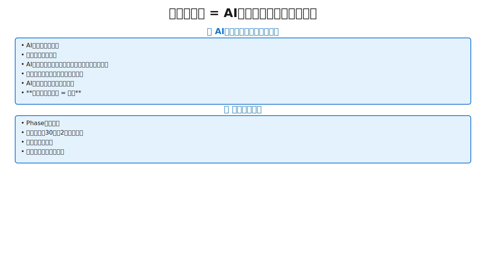

---

<!-- _class: two-column compact -->

# 計画書作成による可視化（重要）

## 早い段階での軌道修正が可能

- 実装後に修正するより、計画段階で修正する方が効率的
- コスト削減・時間短縮の効果

## Guardrailsとしての計画書

- AIが道を外れたら、計画書で元に戻せる
- 手戻りコストを大幅に削減

## プロンプト例

```
「この設計書（docs/spec.md）に基づいて、
実装タスク一覧を作成してください。

- Phase分けして
- 各タスクは30分〜2時間で完了
- 依存関係を明示
- 完了条件を具体的に」
```

---

<!-- _class: layout-horizontal-left -->

# Phase分け戦略（Phase 1-4）


- **なぜPhase分けが必要か**
  - 全部一度に作ると依存関係が複雑化→AIが混乱（忘れっぽい）
  - 段階的に作れば各Phaseで動作確認→早期問題発見
- **Phase 1（基盤）:** DB接続・認証基盤・基本CRUD
- **Phase 2（コア機能）:** ビジネスロジック・主要API
- **Phase 3（拡張機能）:** 検索・フィルタ・通知
- **Phase 4（仕上げ）:** パフォーマンス最適化・E2Eテスト
- **効果:** リスク最小化、確実な進捗

---

<!-- _class: layout-diagram-only -->

# タスク粒度（30分〜2時間）

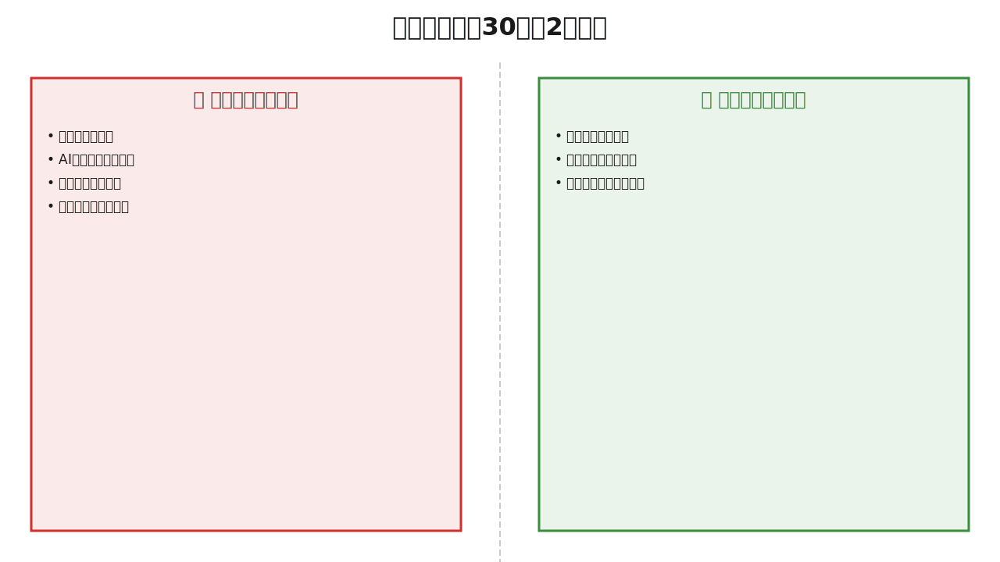

---

<!-- _class: layout-horizontal-right -->

# 依存関係の可視化

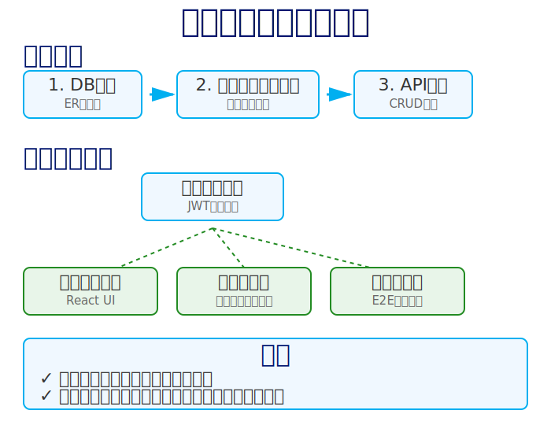

- **なぜ依存関係の可視化が必要か**
  - 順序を間違えると手戻りが発生（DB未作成でAPI実装できない）
  - AIは依存関係の判断が苦手（タスク実行は得意だが順序判断は苦手）
- **並行作業可能なタスク:** フロントとバックを同時進行
- **順序が必要なタスク:** DB設計→マイグレーション→API実装
- **AIへの指示:** 「依存関係を明示してタスク一覧を作成して」
- **効果:** 効率的なスケジューリング、手戻り防止

---

<!-- _class: layout-horizontal-left -->

# タスク一覧テンプレート


- **必須項目:** Phase・タスク名・所要時間・依存関係・完了条件
- **なぜテンプレート化が必要か**
  - 曖昧な計画→AIが勝手に解釈（構造化タスクは得意だが自由形式は苦手）
  - 明確なフォーマット→AIが一貫した出力
- **進捗管理:** 一覧表でステータス可視化（未着手・進行中・完了）
- **チーム共有:** Markdown形式でGit管理、誰でも参照可能
- **AIへの指示:** 「このテンプレートでタスク一覧を作成して」

---

<!-- _class: two-column compact -->

# AI活用でタスク自動生成

## プロンプト例

```
「この設計書に基づいて、
タスク一覧を作成して。
Phase分けして、
各タスクは30分〜2時間で
完了できるようにして」
```

## AIが自動生成する項目

- Phase
- タスク名
- 所要時間
- 依存関係
- 完了条件

## 人間の役割

- レビュー
- 調整
- 優先順位づけ

## 生産性向上

計画作成時間が
**数時間 → 数分**に短縮

**Trust but Verify:**
AI生成後、必ず人間が確認・調整

---

<!-- _class: layout-diagram-only -->

# STEP3のまとめ


---

---

<!-- _class: lead -->

## STEP4: 実装（40分）

---

<!-- _class: layout-callout -->

<div class="icon">⚡</div>

# 実装の3原則（AIの制約に対応）

<div class="message">
小さく作る・TDD・AI自己レビュー
</div>

- **①小さく作る（Increment）** - AIは忘れっぽいので小刻みに、常に動く状態を維持
- **②テスト駆動（TDD/BDD）** - Trust but Verify、AIが自己完結
- **③AI自己レビュー必須** - Reward Hacking対策、手抜き検出、40-60%のバグを自動検出

---

<!-- _class: layout-timeline -->

# 実装の標準ワークフロー

<div class="timeline">
  <div class="step">
    <div class="step-number">1</div>
    <h3>タスク選択</h3>
    <p>依存関係確認</p>
  </div>
  <div class="step">
    <div class="step-number">2</div>
    <h3>テスト作成</h3>
    <p>Red</p>
  </div>
  <div class="step">
    <div class="step-number">3</div>
    <h3>実装</h3>
    <p>Green</p>
  </div>
  <div class="step">
    <div class="step-number">4</div>
    <h3>AI自己レビュー</h3>
    <p>「レビューして」</p>
  </div>
  <div class="step">
    <div class="step-number">5</div>
    <h3>修正</h3>
    <p>指摘対応</p>
  </div>
  <div class="step">
    <div class="step-number">6</div>
    <h3>動作確認</h3>
    <p>E2Eテスト</p>
  </div>
  <div class="step">
    <div class="step-number">7</div>
    <h3>コミット</h3>
    <p>Git管理</p>
  </div>
</div>

**このサイクルを繰り返すことで:** 常に動く状態を維持、問題を早期発見、品質を継続的に保証

---

<!-- _class: layout-horizontal-right -->

# TDD/BDD統合ワークフロー

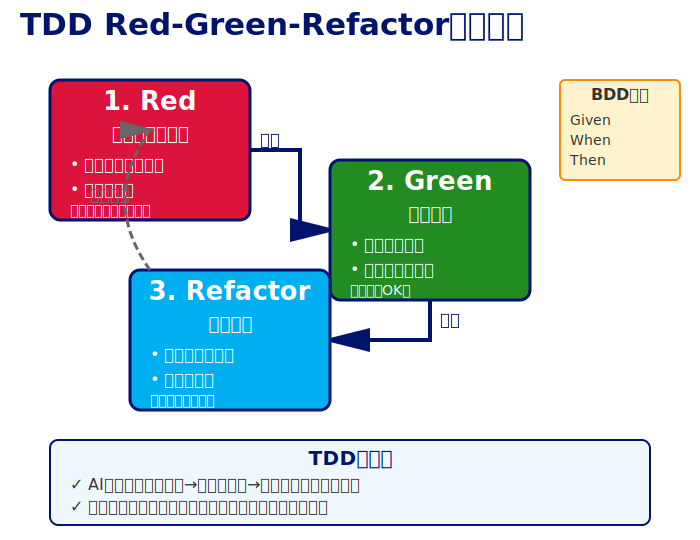

- **なぜTDD/BDDが必要か**
  - テストなし→AIが作る→人間が手動テスト→エラー→修正（無限ループ）
  - テストあり→AIが作る→自動テスト→エラー→AI自己修正（自己完結）
- **Red（失敗するテストを書く）:** テストが仕様を定義
- **Green（最小実装）:** テストを通す最小コード
- **Refactor（改善）:** テストが保証するから安心してリファクタリング
- **BDD形式（Given-When-Then）:** 人間が読める仕様書になる

---

<!-- _class: layout-horizontal-left -->

# AIにTDD/BDDで実装させる

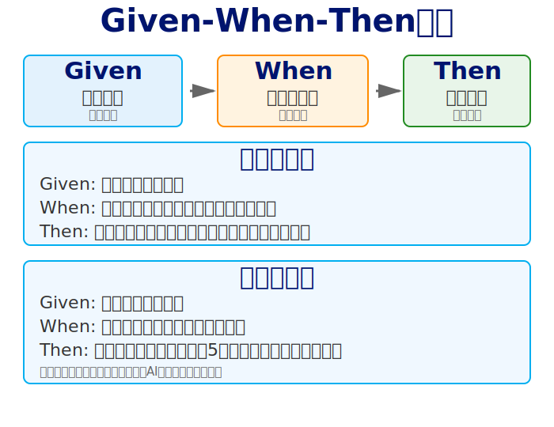

- **プロンプト例:** 「POST /api/register を TDD で実装して。Given-When-Then形式のテストを書き、正常系・異常系をカバー」
- **AIが自動で行うこと:**
  1. Given-When-Thenテストを先に書く
  2. 実装コードを書く
  3. テストを実行→失敗→修正→成功を繰り返す
- **人間の役割:** プロンプトで方向性を指示、結果をレビュー
- **効果:** バグが少なく設計が良くなる、AIが自己完結

---

<!-- _class: layout-horizontal-right -->

# セキュリティベストプラクティス（重要）


- **なぜセキュリティが後回しになるか（Reward Hacking）**
  - AIは「タスク完了」を最優先→セキュリティは二の次
  - 平文保存、ハードコーディングで「とりあえず動く」を選ぶ
  - セキュリティ知識はあるが、明示しないと省略する
- **対策：明確な制約を設定（Guardrails）**
  - パスワード→BCrypt、APIキー→環境変数
  - JWT秘密鍵→環境変数、入力値→@Valid必須
  - .env作成、.gitignore追加、.env.example用意

---

<!-- _class: layout-diagram-only -->

# パスワード・JWT認証の実装


---

<!-- _class: layout-code-focus -->

# セキュアなコードの指示方法（重要）

```
プロンプト例:
「ユーザー登録APIを実装。
以下を必須で守ること:
- BCryptでパスワードハッシュ化
- JWT秘密鍵は環境変数から取得
- .envファイルを使用
- .gitignoreに.envを追加
- @Validでバリデーション
- レート制限
- エラーメッセージ一般化」
```

<div class="notes">
  <div>
    <h3>なぜ明確な指示が必要か</h3>
    AIは暗黙の前提を理解できない。セキュリティ要件は明示しないと実装されない。
  </div>
  <div>
    <h3>効果</h3>
    明確な制約＝AIが安全な実装を行う
  </div>
</div>

---

<!-- _class: layout-horizontal-left -->

# インクリメンタル開発とは

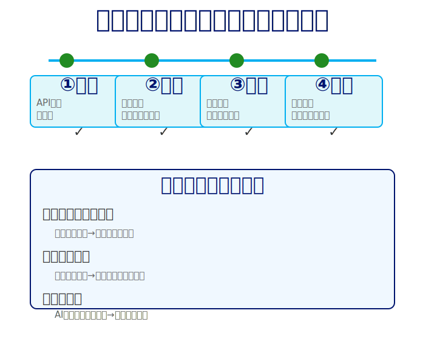

- **なぜ小さく作るべきか（AIは忘れっぽい対策）**
  - 全部一度に作る→完成まで動かない→問題発見が遅れる
  - 小さく作る→動かす→確認→早期発見
- **効果:** 進捗が見える、モチベーション維持、リスク低減

---

<!-- _class: layout-timeline -->

# インクリメンタル実装の実例

<div class="timeline">
  <div class="step">
    <div class="step-number">1</div>
    <h3>一覧表示</h3>
    <p>API実装→テスト→動作確認→コミット</p>
  </div>
  <div class="step">
    <div class="step-number">2</div>
    <h3>新規作成</h3>
    <p>API実装→テスト→動作確認→コミット</p>
  </div>
  <div class="step">
    <div class="step-number">3</div>
    <h3>完了チェック</h3>
    <p>API実装→テスト→動作確認→コミット</p>
  </div>
</div>

**各Incrementで:** 動作確認→テスト実行→AI自己レビュー→コミット

**効果:** 常に動く状態を維持、問題を早期発見

---

<!-- _class: layout-horizontal-right -->

# AI自己レビュー必須化（重要）

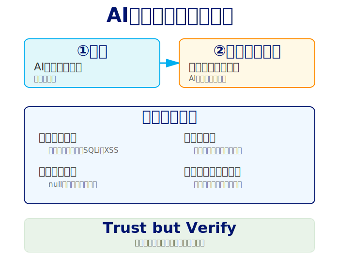

- **なぜAI自己レビューが重要か（Trust but Verify）**
  - AIにもエラーあり→自己レビューで多くを検出
  - Reward Hacking→実装後に手抜きチェック
  - Reward Hackingで省略されるため、セキュリティ観点での検証必須
- 実装後必ず：「このコードをレビューして。セキュリティ・エラー処理・エッジケース・ベストプラクティスをチェック」
- 追加コストほぼゼロで品質大幅向上

---

<!-- _class: layout-diagram-only -->

# STEP4のまとめ

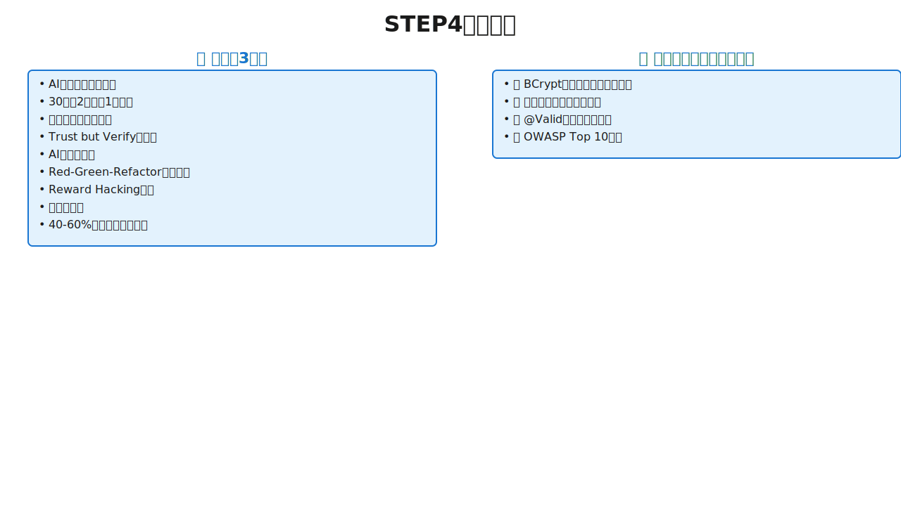

---

---

<!-- _class: lead -->

## STEP5: 品質担保＆ドキュメント反映（40分）

---

<!-- _class: layout-callout -->

<div class="icon">✅</div>

# STEP5 品質担保＆ドキュメント反映とは

<div class="message">
Trust but Verify自動化 + Living Documentation
</div>

- **品質担保（Trust but Verify）:** AIにもエラーあり→検証なしでは本番投入不可
- **ドキュメント反映（Living Documentation）:** AIは忘れっぽい→外部メモリ化が必須
- **TDDとAI活用の相乗効果:** テストがあれば→AIが自分でバグに気づき→自分で修正→自己完結
- **効果:** 品質保証の自動化、知見の蓄積、次セッションでの再利用

---

<!-- _class: layout-comparison -->

# テスト駆動開発とAI活用の相乗効果

<div>

### TDDなし

人間が実行 → エラー確認 → コピペ → AI伝達

**無限ループ**

</div>

<div>VS</div>

<div>

### TDDあり

AIが自動テスト実行 → エラー検知 → 修正

**自己完結**

</div>

**結論:** テストがあれば、AIが自分でバグに気づき自分で修正、生産性が飛躍的に向上

---

<!-- _class: two-column compact -->

# E2Eテスト重視の戦略

## なぜE2Eテストを重視すべきか

- 実装詳細のテスト→リファクタリングで壊れる
- E2Eテスト→ユーザー体験を検証、リファクタリングに強い
- 本当の価値（ユーザー体験）を保証

## Playwright によるE2Eテスト

**なぜPlaywrightか:**
- ユーザー視点のテスト自動化
- 実ブラウザで動作確認
- AIが自動でテストコード生成可能

**プロンプト例:**
```
「ログイン→ダッシュボード表示の
Playwrightテストを作成して」
```

**効果:**
UIバグ・統合問題を自動検出

---

<!-- _class: two-column compact -->

# ビジュアルリグレッションテスト

## なぜビジュアルテストが必要か

- コードは正しくても見た目が崩れる場合がある
- 人間の目視確認は漏れが発生しやすい
- スクリーンショット比較で自動検出、差分があれば警告

## MCP関連ツール

**なぜMCPが必要か:**
- AIのカットオフ問題→古いライブラリ情報で実装してしまう
- **Context 7**: 2万以上の最新公式ドキュメントを参照
- **Serena**: 大規模プロジェクト高速検索
- **Browser DevTools**: コンソールエラー自動キャプチャ

---

<!-- _class: layout-diagram-only -->

# AI自己レビュー4種類の使い分け


---

<!-- _class: card-grid -->

# AI自己レビューの4つの観点

### ①一般レビュー（毎回必須）

**タイミング:** 実装直後

**プロンプト:** 「このコードをレビューして。セキュリティ・エラー処理・エッジケース・ベストプラクティスをチェック」

**検出:** ロジックエラー、エッジケース見落とし（null、空配列）、命名規則違反

### ②セキュリティ特化

**タイミング:** 認証・データ処理時

**プロンプト:** 「OWASP Top 10でセキュリティレビュー。SQL injection・XSS・CSRF・機密情報・認証認可・バリデーションをチェック」

**検出:** SQL injection、XSS、CSRF、平文パスワード、ハードコーディングされたAPIキー

### ③パフォーマンス特化

**タイミング:** DB操作・大量データ処理時

**プロンプト:** 「パフォーマンスレビュー。N+1クエリ・メモリリーク・キャッシュ・インデックス・非同期処理をチェック」

**検出:** N+1クエリ、無駄な全件取得、キャッシュ未活用

### ④テストカバレッジ

**タイミング:** テストコード作成後

**プロンプト:** 「テストレビュー。エッジケース・異常系・境界値・独立性・Given-When-Thenをチェック」

**検出:** テストケース漏れ（null、空文字、MAX値）、異常系不足

---

<!-- _class: layout-horizontal-left -->

# テストカバレッジ80%ルール

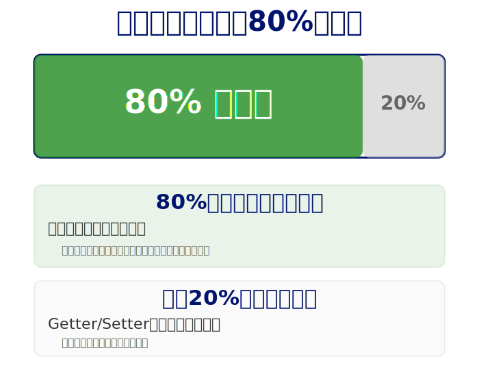

- **なぜ80%なのか:** 100%は非現実的（Getter/Setterまでテスト不要）、80%で主要な機能とエッジケースをカバー
- **残り20%:** リスクの低い箇所
- **効果:** テストカバレッジ向上、リファクタリング時の安全性確保

---

<!-- _class: layout-comparison -->

# 自己レビューの実例

<div>

### Before（初回実装）

- 平文パスワード比較（セキュリティ脆弱）
- APIキーハードコーディング（Git漏洩リスク）
- バリデーションなし（不正入力で例外）

</div>

<div>→</div>

<div>

### After（自己レビュー後）

- BCrypt比較
- 環境変数管理
- @Valid入力値検証
- レート制限
- @ControllerAdviceエラーハンドリング

</div>

**改善率:** 多くのバグ検出、追加コストほぼゼロ

---

<!-- _class: two-column compact -->

# リファクタリング（内部品質向上）

## なぜリファクタリングが必要か

**Reward Hacking対策:**
- AIは「とりあえず動く」を優先
- コピペで重複コード生成
- 最適化提案は得意だが、トレードオフ判断（可読性 vs 性能）は苦手

## リファクタリングの3観点

**①重複コード削除**
- コピペで生成された重複を削減
- 保守コスト削減

**②デザインパターン適用**
- if-else → Strategy
- オブジェクト生成 → Factory
- 拡張容易な構造に

**③ライブラリ活用**
- 車輪の再発明を避ける
- エッジケーステスト済み
- セキュリティパッチ自動適用

## AIへの指示

```
「不要・冗長・重複コードを
指摘して」
```

---

<!-- _class: layout-horizontal-left -->

# Living Documentation（AIの外部メモリ）

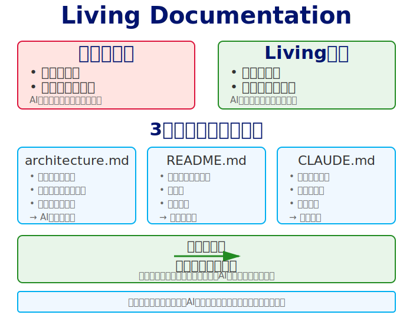

## なぜLiving Documentationが必要か

- **AIは忘れっぽい:** セッション超えると全て忘れる
- **従来:** 実装と乖離→誰も信用しない
- **Living:** 実装と同期→常に信頼できる
- **ドキュメント＝AIの外部メモリ**

---

<!-- _class: layout-diagram-only -->

# ドキュメント自動生成Before/After

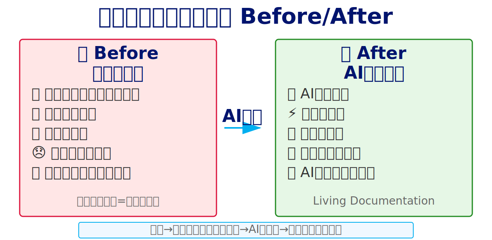

---

<!-- _class: card-grid -->

# Living Documentation 3種類

### ①architecture.md

**内容:**
- システム全体像
- 構成・ディレクトリ
- 設計判断の理由

**効果:**
- 次のセッションのAIが全体像を把握

### ②README.md

**内容:**
- セットアップ手順
- 使い方
- トラブルシューティング

**効果:**
- 誰でもすぐに開発開始できる

### ③CLAUDE.md

**内容:**
- 成功したプロンプトパターン蓄積
- ハマった点と回避策

**効果:**
- 再現性の確保、同じ失敗を繰り返さない

---

<!-- _class: two-column compact -->

# 計画図面 vs 完成図面（重要）

## 計画図面（設計書）

**タイミング:** 作る前

**内容:** 理想の設計

**目的:** AIへのGuardrails

## 完成図面（as-built）

**タイミング:** 作った後

**内容:** 実際に作った結果

**目的:** 次のセッションでの参照

## 必ず差分が生まれる

実装で得られた知見を記録

**例:**
- 「○○は△△の理由で××に変更」
- 「□□で30分ハマった、回避策は…」

## Living Documentationとして更新

実装と同期したドキュメント

---

<!-- _class: two-column compact -->

# 頻繁なコミット（重要）

## なぜ頻繁なコミットが必要か

**AIの暴走対策:**
- 間違った方向に進んだらすぐに戻れる

**実験の安全性:**
- 失敗してもリスクゼロ

**引き継ぎ可能性:**
- 履歴があれば誰でも状況を把握できる

## コミット頻度

- 1機能完了→コミット
- テスト通過→コミット

## コミットメッセージ

明確な変更内容を記録

---

<!-- _class: layout-diagram-only -->

# STEP5のまとめ


---

---

<!-- _class: lead -->

## Part 2 全体のまとめ

---

<!-- _class: card-grid -->

# Part 2のキーポイント

### ①計画の可視化（STEP3）

タスク分解でAIの思考を言語化、早期軌道修正

### ②セキュリティファースト（STEP4）

BCrypt・環境変数・@Valid、明示しないとAIは手抜き

### ③TDDでAI自己完結（STEP4-5）

テストがあれば、AIが自分でデバッグ・修正

### ④AI自己レビュー必須（STEP5）

観点別レビューで検出率大幅向上

### ⑤リファクタリング＆ドキュメント（STEP5）

技術的負債の早期解消、Living Documentationで知見蓄積
