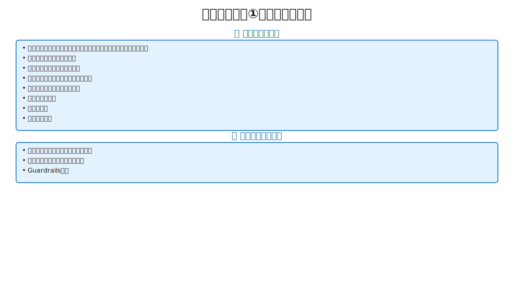

# Day 1-3: まとめ + 演習 (15:00-17:00)

---

<!-- _class: lead -->

## まとめ（5分）

---

<!-- _class: layout-diagram-only -->

# 1日目の振り返り


**5-STEPフロー:** 要件定義 → 設計 → タスク分解 → 実装 → 品質担保

**成功の鍵:** 各ステップを確実に実行、飛ばさない、AIの制約を理解

---
<!-- _class: layout-diagram-only -->

# よくある失敗①いきなりコード



---

# よくある失敗②AI自己レビュースキップ
- **なぜ失敗するか（Trust but Verify原則違反）**
  - AIにもエラーあり→検証なしは危険
  - Reward Hacking→明示されない品質要件を省略してしまう
- **「このコードをレビューして」の習慣化で品質改善**
- 追加コストほぼゼロ

---

# よくある失敗③リファクタリング後回し
- **なぜ失敗するか（Reward Hacking）**
  - AIは「タスク完了」優先→リファクタリングは後回し
  - 「動くからいいや」で放置→技術的負債が蓄積
- テストがあれば安心してリファクタリングできる
- 早期解消が重要

---

<!-- _class: layout-diagram-only -->

# 1日目のキーメッセージ


---
<!-- _class: layout-diagram-only -->

# 演習課題の説明（TODOアプリ）


---

---

<!-- _class: lead -->

## 演習（115分 ≒ 2時間）

---
<!-- _class: layout-diagram-only -->

# 演習の目的と課題


---

<!-- _class: two-column compact -->

### 演習の進め方（時間配分）

#### 15:05-15:15（10分）：環境セットアップ
- Claude Code環境確認、プロジェクト作成
- 課題要件確認

#### 15:15-15:35（20分）：STEP1-2 要件・設計
- AIに質問させて仕様確定
- 要件定義（ユーザーストーリー、エッジケース）
- 設計（Tech Stack、DBスキーマ、API仕様）
- ゴール: 曖昧さ完全排除

#### 15:35-15:50（15分）：STEP3 タスク分解
- タスク一覧作成（Phase分け、30分〜2時間粒度）
- ゴール: AI思考の可視化

#### 15:50-16:20（30分）：STEP4 実装
- TDD（Red-Green-Refactor）
- インクリメンタル開発、セキュリティチェック
- AI自己レビュー
- ゴール: AI自己完結の体感

#### 16:20-17:00（40分）：STEP5 品質担保＆ドキュメント反映
- テスト実行・カバレッジ確認
- リファクタリング（重複削減、パターン適用）
- ドキュメント生成（architecture.md、README.md、CLAUDE.md）
- ゴール: Trust but Verify自動化、Living Documentation

---

<!-- _class: two-column compact -->

### 演習のゴール
- **5-STEPの流れを体験する**
- **AIとの対話方法を習得する**
- **TDDの効果を実感する**
- **リファクタリングによる品質向上を体験する**
- **セキュアな実装の重要性を理解する**

### 講師サポート
- 各自のペースで進める（全ステップ完了は必須ではない）
- つまずいたら挙手して講師に質問
- 他の参加者と相談・情報共有OK
- 成功したプロンプトの共有を推奨

---

---

<!-- _class: lead -->

## 演習でよくあるつまずきポイントと対処法

---
<!-- _class: layout-diagram-only -->

# つまずきポイントと対処法


---

---

<!-- _class: lead -->

## 演習成功のチェックリスト

---

<!-- _class: layout-diagram-only -->

# 演習成功のチェックリスト①


---
<!-- _class: layout-diagram-only -->

# 演習成功のチェックリスト②


---

---

<!-- _class: lead -->

## 演習で体感できること

---

<!-- _class: two-column -->

# 演習で体感できること

### ① 前工程の重要性
- **STEP1-2丁寧実施：** スムーズ、手戻り少、完成早い
- **STEP1-2省略：** 迷う、手戻り多発、遅い

### ② TDDの威力
- **テストなし：** 人間実行→エラー確認→コピペ→AI伝達→修正（無限ループ）
- **テストあり：** AI自動テスト→検知→修正→成功（自己完結）

### ③ AI自己レビューの効果
- **Before：** バグだらけ
- **After：** 多くのバグ検出・修正
- **追加コスト：** ほぼゼロ（数秒）

### ④ インクリメンタル開発の安心感
- **全部一度：** 動くまで不安、原因特定困難
- **小さく作る：** 常に動作確認、原因特定容易、進捗見える

### ⑤ Living Documentationの価値
- **ドキュメントなし：** AIが忘れる、同じ間違い繰り返す
- **ドキュメントあり：** AI参照可能、間違い防止、引き継ぎ容易

---

---

<!-- _class: lead -->

## 演習の成果物

---

# 成果物：ディレクトリ構成

```
プロジェクトディレクトリ/
├── docs/               # 要件・設計・タスク・完成図面
├── src/
│   ├── main/java/      # 本番コード
│   └── test/java/      # テストコード
├── README.md
├── .env.example
└── .gitignore
```

---

<!-- _class: two-column -->

# 成果物：品質基準

**ドキュメント品質**
- 曖昧さがない（誰が読んでも同じ解釈）
- 受け入れ条件が明確（Given-When-Then形式）
- エラー・エッジケースを網羅
- 設計判断の理由を記録

**コード品質**
- テストカバレッジ80%以上
- セキュリティベストプラクティス適用
- 環境変数で秘密情報管理
- リファクタリング済み

---

---

<!-- _class: lead -->

## 1日目全体の振り返り

---
<!-- _class: layout-diagram-only -->

# 1日目全体の振り返り


---

---

<!-- _class: two-column compact -->

## 2日目への準備

**📅 2日目の内容**
- リバースエンジニアリング
- テストシナリオ作成
- デグレ防止

**📚 復習推奨**
- 5-STEP フロー
- AI制約対策
- TDD/BDD

**🏠 宿題**
- TODOアプリ機能追加
- 自プロジェクトで5-STEP
- AI自己レビュー習慣化
